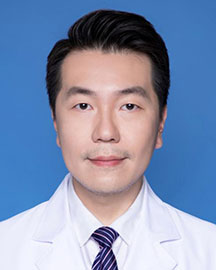

<!-- AUTO-GENERATED-BY: work/generate_obsidian_profiles.py -->

<!-- TEMPLATE: D:\workspace\信息收集整理\医生画像仓库\模板\医生画像模板.md -->

# 周子浩

## 基础信息

| 字段 | 内容 |
|---|---|
| 姓名 | 周子浩 |
| 医院 | 广东省人民医院 |
| 科室 | 胸外科 |
| 职称/身份 | 副主任医师 |
| 来源链接 | [官网原文](https://www.gdghospital.org.cn/Expertlistt/info_itemid_23921_subjectid_8.html) |
| 采集日期 | 2026-08-14 |

## 简介/擅长

肺磨玻璃结节外科手术治疗

## 科研项目与成果

- 学术专业领域成就 主持广东省医学科学技术研究基金课题研究一项，参与完成广州市产学研协同创新重大专项民生科技研究及广东省自然科学基金研究多项；
- 获国家级专利一项；

## 论文与学术产出

- 发表SCI及核心期刊论文多篇；
- 参编专著2部。

## 可包装亮点

- 中共党员，医学硕士 主要社会兼职 广东省健康管理学会胸部肿瘤多学科协作专业委员会 常委 广东省药学会胸外科专业委员会 委员 广东省基层医药学会肺癌专业委员会 委员 广东省中西医结合学会微创外科专业委员会 委员 广东省胸部疾病学会肺癌多学科治疗专业委员会 委员 广东省医师协会胸外科专业委员会肺癌专业组 组员 专业特长 2004年起从事胸外科临床工作。
- 发表SCI及核心期刊论文多篇；
- 获国家级专利一项；

## 重点疾病/人群标签

- 慢性病：
- 肿瘤：肿瘤、癌、肺癌、康复、多学科
- 生殖疾病：
- 免疫/风湿：
- 术后恢复/康复：肿瘤、癌、肺癌、康复、多学科
- 疑难重症：肿瘤、癌、肺癌、康复、多学科

## 证据摘录

> 只摘录官网公开信息中的短句或关键字段，不复制大段原文。

- 官网身份字段：副主任医师
- 官网简介/擅长：肺磨玻璃结节外科手术治疗
- 官网亮眼经历线索：中共党员，医学硕士 主要社会兼职 广东省健康管理学会胸部肿瘤多学科协作专业委员会 常委 广东省药学会胸外科专业委员会 委员 广东省基层医药学会肺癌专业委员会 委员 广东省中西医结合学会微创外科专业委员会 委员 广东省胸部疾病学会肺癌多学科治疗专业委员会 委员 广东省医师协会胸外科专业委员会肺癌专业组 组员 专业特长 2004年起从事胸外科临床工作。 发表SCI及核心期刊论文多篇； 获国家级专利一项；
- 来源链接：https://www.gdghospital.org.cn/Expertlistt/info_itemid_23921_subjectid_8.html

## BD 画像摘要

周子浩医生可作为肿瘤、术后恢复/康复、疑难重症方向的基础画像候选。后续 BD 使用应继续以官网来源和人工复核为准，不添加疗效承诺或无来源包装。

## 合规边界

- 仅使用医院官网、官方公众号、官方小程序等公开渠道。
- 不采集私人电话、私人微信、家庭住址、患者隐私或非公开排班信息。
- 不写“保证治愈”“疗效第一”“包治疑难杂症”等无法由官网证明的表述。
