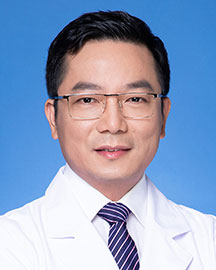

<!-- AUTO-GENERATED-BY: work/generate_obsidian_profiles.py -->

<!-- TEMPLATE: D:\workspace\信息收集整理\医生画像仓库\模板\医生画像模板.md -->

# 周德祥

## 基础信息

| 字段 | 内容 |
|---|---|
| 姓名 | 周德祥 |
| 医院 | 广东省人民医院 |
| 科室 | 神经外科 |
| 职称/身份 | 主任医师 |
| 来源链接 | [官网原文](https://www.gdghospital.org.cn/Expertlistt/info_itemid_24774_subjectid_11.html) |
| 采集日期 | 2026-08-14 |

## 简介/擅长

从事神经外科临床工作30年，擅长用神经内镜微创技术和显微神经外科技术单独或联合（双镜结合，择优选择，优势互补）治疗各种颅内肿瘤（如脑膜瘤、垂体瘤、胶质瘤、颅咽管瘤、听神经瘤、转移瘤、神经鞘瘤、室管膜瘤、胆脂瘤、血管母细胞瘤等），尤其专长颅底肿瘤、鞍区及脑干肿瘤等高难度手术

## 教育与进修经历

- 教育经历 ： 汕头大学大学本科毕业（1997年）及硕士研究生毕业（2003年）；
- 南方医科大学博士研究生毕业（2008年）；

## 科研项目与成果

- 学术领域成就 ： 主持及参与国家级、省市级科研项目20多项，发表论文20多篇，其中SCI论文5篇，主编著作两部，获得汕头市科技进步一等奖1项。

## 论文与学术产出

- 学术领域成就 ： 主持及参与国家级、省市级科研项目20多项，发表论文20多篇，其中SCI论文5篇，主编著作两部，获得汕头市科技进步一等奖1项。

## 可包装亮点

- 医学博士，科室行政副主任，硕士生导师，岭南名医。
- 社会任职 ： 广东省医学教育协会神经外科专业委员会主任委员兼内镜神经外科分会副主任委员；
- 广东省医院协会神经外科专业委员会副主任委员，广东省医学会神经外科分会颅底鞍区学组副组长；
- 欧美同学会医师协会颅底肿瘤分会常委；

## 重点疾病/人群标签

- 慢性病：
- 肿瘤：肿瘤、癌、瘤、肺癌
- 生殖疾病：
- 免疫/风湿：
- 术后恢复/康复：
- 疑难重症：

## 证据摘录

> 只摘录官网公开信息中的短句或关键字段，不复制大段原文。

- 官网身份字段：主任医师
- 官网简介/擅长：从事神经外科临床工作30年，擅长用神经内镜微创技术和显微神经外科技术单独或联合（双镜结合，择优选择，优势互补）治疗各种颅内肿瘤（如脑膜瘤、垂体瘤、胶质瘤、颅咽管瘤、听神经瘤、转移瘤、神经鞘瘤、室管膜瘤、胆脂瘤、血管母细胞瘤等），尤其专长颅底肿瘤、鞍区及脑干肿瘤等高难度手术
- 官网亮眼经历线索：医学博士，科室行政副主任，硕士生导师，岭南名医。 社会任职 ： 广东省医学教育协会神经外科专业委员会主任委员兼内镜神经外科分会副主任委员； 广东省医院协会神经外科专业委员会副主任委员，广东省医学会神经外科分会颅底鞍区学组副组长； 欧美同学会医师协会颅底肿瘤分会常委；
- 来源链接：https://www.gdghospital.org.cn/Expertlistt/info_itemid_24774_subjectid_11.html

## BD 画像摘要

周德祥医生可作为肿瘤方向的基础画像候选。后续 BD 使用应继续以官网来源和人工复核为准，不添加疗效承诺或无来源包装。

## 合规边界

- 仅使用医院官网、官方公众号、官方小程序等公开渠道。
- 不采集私人电话、私人微信、家庭住址、患者隐私或非公开排班信息。
- 不写“保证治愈”“疗效第一”“包治疑难杂症”等无法由官网证明的表述。
