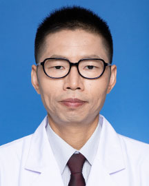

<!-- AUTO-GENERATED-BY: work/generate_obsidian_profiles.py -->

<!-- TEMPLATE: D:\workspace\信息收集整理\医生画像仓库\模板\医生画像模板.md -->

# 周正根

## 基础信息

| 字段 | 内容 |
|---|---|
| 姓名 | 周正根 |
| 医院 | 广东省人民医院 |
| 科室 | 放射科 |
| 职称/身份 | 副主任医师 |
| 来源链接 | [官网原文](https://www.gdghospital.org.cn/Expertlistt/info_itemid_58498_subjectid_64.html) |
| 采集日期 | 2026-08-14 |

## 简介/擅长

头颈五官影像诊断 临床放射诊断经验丰富，作为本院头颈肿瘤多学科诊疗（MDT）的主要成员之一，参与头颈部肿瘤的多学科讨论超过16年

## 论文与学术产出

- 发表论文多篇。

## 可包装亮点

- 专长 ：头颈五官影像诊断 临床放射诊断经验丰富，作为本院头颈肿瘤多学科诊疗（MDT）的主要成员之一，参与头颈部肿瘤的多学科讨论超过16年。
- 发表论文多篇。
- 现为中国医师协会放射医师分会第五届头颈工作组委员，广东省医学会放射学分会头颈学组委员，广东省医师协会放射医师分会头颈学组委员。

## 重点疾病/人群标签

- 慢性病：
- 肿瘤：肿瘤、多学科、MDT
- 生殖疾病：
- 免疫/风湿：
- 术后恢复/康复：
- 疑难重症：肿瘤、多学科、MDT

## 证据摘录

> 只摘录官网公开信息中的短句或关键字段，不复制大段原文。

- 官网身份字段：副主任医师
- 官网简介/擅长：头颈五官影像诊断 临床放射诊断经验丰富，作为本院头颈肿瘤多学科诊疗（MDT）的主要成员之一，参与头颈部肿瘤的多学科讨论超过16年
- 官网亮眼经历线索：专长 ：头颈五官影像诊断 临床放射诊断经验丰富，作为本院头颈肿瘤多学科诊疗（MDT）的主要成员之一，参与头颈部肿瘤的多学科讨论超过16年。 发表论文多篇。 现为中国医师协会放射医师分会第五届头颈工作组委员，广东省医学会放射学分会头颈学组委员，广东省医师协会放射医师分会头颈学组委员。
- 来源链接：https://www.gdghospital.org.cn/Expertlistt/info_itemid_58498_subjectid_64.html

## BD 画像摘要

周正根医生可作为肿瘤、疑难重症方向的基础画像候选。后续 BD 使用应继续以官网来源和人工复核为准，不添加疗效承诺或无来源包装。

## 合规边界

- 仅使用医院官网、官方公众号、官方小程序等公开渠道。
- 不采集私人电话、私人微信、家庭住址、患者隐私或非公开排班信息。
- 不写“保证治愈”“疗效第一”“包治疑难杂症”等无法由官网证明的表述。
