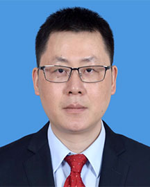

<!-- AUTO-GENERATED-BY: work/generate_obsidian_profiles.py -->

<!-- TEMPLATE: D:\workspace\信息收集整理\医生画像仓库\模板\医生画像模板.md -->

# 周泉波

## 基础信息

| 字段 | 内容 |
|---|---|
| 姓名 | 周泉波 |
| 医院 | 广东省人民医院 |
| 科室 | 胰腺中心 |
| 职称/身份 | 主任医师 |
| 来源链接 | [官网原文](https://www.gdghospital.org.cn/Expertlistt/info_itemid_46624_subjectid_106.html) |
| 采集日期 | 2026-08-14 |

## 简介/擅长

胰腺癌、肝癌、胆囊癌、壶腹部肿瘤等肿瘤的腹腔镜微创手术

## 教育与进修经历

- 简介 主任医师、教授、博士生导师、博士后导师，引进外科专家。
- 中山大学临床医学博士毕业，从事肝胆胰外科临床工作20年，曾任中山大学孙逸仙纪念医院胆胰外科副主任，深汕院区院长助理、大外科主任、肝胆胰外科主任。

## 可包装亮点

- 普外科行政主任、胰腺中心行政副主任，医学博士，教授/主任医师，博士生导师 特长 在肝胆胰良恶性疾病的微创手术治疗有极高造诣，擅长胰腺癌、肝癌、胆囊癌、壶腹部肿瘤等肿瘤的腹腔镜微创手术。
- 简介 主任医师、教授、博士生导师、博士后导师，引进外科专家。
- 中山大学临床医学博士毕业，从事肝胆胰外科临床工作20年，曾任中山大学孙逸仙纪念医院胆胰外科副主任，深汕院区院长助理、大外科主任、肝胆胰外科主任。
- 兼任中国微循环学会转化医学分会副主委、中国研究型医院学会胰腺专业青年委员会副主任委员、中国医促会胰腺专委会青年委员会副主任委员、广东省精准医学罕见肿瘤分会副主任委员、广东省医师学会胰腺疾病专委会青委副主委、广东省抗癌协会胰腺专委会青委副主委、中国医师协会微无创医学专委会委员等职。

## 重点疾病/人群标签

- 慢性病：
- 肿瘤：
- 生殖疾病：
- 免疫/风湿：
- 术后恢复/康复：
- 疑难重症：

## 证据摘录

> 只摘录官网公开信息中的短句或关键字段，不复制大段原文。

- 官网身份字段：主任医师
- 官网简介/擅长：胰腺癌、肝癌、胆囊癌、壶腹部肿瘤等肿瘤的腹腔镜微创手术
- 官网亮眼经历线索：普外科行政主任、胰腺中心行政副主任，医学博士，教授/主任医师，博士生导师 特长 在肝胆胰良恶性疾病的微创手术治疗有极高造诣，擅长胰腺癌、肝癌、胆囊癌、壶腹部肿瘤等肿瘤的腹腔镜微创手术。 简介 主任医师、教授、博士生导师、博士后导师，引进外科专家。 中山大学临床医学博士毕业，从事肝胆胰外科临床工作20年，曾任中山大学孙逸仙纪念医院胆胰外科副主任，深汕院区院长助理、大外科主任、肝胆胰外科主任。 兼任中国微循环学会转化医学分会副主委、中国研…
- 异常提示：同名待甄别
- 来源链接：https://www.gdghospital.org.cn/Expertlistt/info_itemid_46624_subjectid_106.html

## BD 画像摘要

周泉波医生可作为广东省人民医院胰腺中心的基础医生资料入库。当前重点方向以总底表标签为准，官网未展示的信息保持空白。

## 合规边界

- 仅使用医院官网、官方公众号、官方小程序等公开渠道。
- 不采集私人电话、私人微信、家庭住址、患者隐私或非公开排班信息。
- 不写“保证治愈”“疗效第一”“包治疑难杂症”等无法由官网证明的表述。
