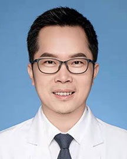

<!-- AUTO-GENERATED-BY: work/generate_obsidian_profiles.py -->

<!-- TEMPLATE: D:\workspace\信息收集整理\医生画像仓库\模板\医生画像模板.md -->

# 周海榆

## 基础信息

| 字段 | 内容 |
|---|---|
| 姓名 | 周海榆 |
| 医院 | 广东省人民医院 |
| 科室 | 胸外科 |
| 职称/身份 | 主任医师 |
| 来源链接 | [官网原文](https://www.gdghospital.org.cn/Expertlistt/info_itemid_23918_subjectid_8.html) |
| 采集日期 | 2026-08-14 |

## 简介/擅长

肺癌、纵隔肿瘤及食管癌的微创综合治疗，以微单孔胸腔镜与机器人辅助胸外科微创手术为主，手术策略优化与围术期加速康复管理

## 教育与进修经历

- 中共党员 博士生导师 博士后合作导师 广东省杰出医学青年人才 哈佛医学院/麻省总医院访问学者 广东省科技进步奖二等奖获得者 （“肺微创手术关键技术研发与推广”1/7） 中国抗癌协会科技奖二等奖获得者（1/10） 广东省医师协会医学机器人医师分会 主任委员 中国抗癌协会整合肿瘤相关结节专业委员会 副主任委员兼秘书长 中国肺癌人工智能与机器人技术转化研究协作组 组长 广东省健康管理学会胸部肿瘤及肺结节管理专业委员会 主任委员 澳门镜湖医院胸外科顾问医生 澳门医学专科学院 Fellow 中国抗癌协会肿瘤人工智能专业委员…

## 可包装亮点

- 中共党员 博士生导师 博士后合作导师 广东省杰出医学青年人才 哈佛医学院/麻省总医院访问学者 广东省科技进步奖二等奖获得者 （“肺微创手术关键技术研发与推广”1/7） 中国抗癌协会科技奖二等奖获得者（1/10） 广东省医师协会医学机器人医师分会 主任委员 中国抗癌协会整合肿瘤相关结节专业委员会 副主任委员兼秘书长 中国肺癌人工智能与机器人技术转化研究协作组…

## 重点疾病/人群标签

- 慢性病：
- 肿瘤：肿瘤、癌、肺癌、康复
- 生殖疾病：
- 免疫/风湿：
- 术后恢复/康复：肿瘤、癌、肺癌、康复
- 疑难重症：

## 证据摘录

> 只摘录官网公开信息中的短句或关键字段，不复制大段原文。

- 官网身份字段：主任医师
- 官网简介/擅长：肺癌、纵隔肿瘤及食管癌的微创综合治疗，以微单孔胸腔镜与机器人辅助胸外科微创手术为主，手术策略优化与围术期加速康复管理
- 官网亮眼经历线索：中共党员 博士生导师 博士后合作导师 广东省杰出医学青年人才 哈佛医学院/麻省总医院访问学者 广东省科技进步奖二等奖获得者 （“肺微创手术关键技术研发与推广”1/7） 中国抗癌协会科技奖二等奖获得者（1/10） 广东省医师协会医学机器人医师分会 主任委员 中国抗癌协会整合肿瘤相关结节专业委员会 副主任委员兼秘书长 中国肺癌人工智能与机器人技术转化研究协作组 组长 广东省健康管理学会胸部肿瘤及肺结节管理专业委员会 主任委员 澳门镜湖医院…
- 来源链接：https://www.gdghospital.org.cn/Expertlistt/info_itemid_23918_subjectid_8.html

## BD 画像摘要

周海榆医生可作为肿瘤、术后恢复/康复方向的基础画像候选。后续 BD 使用应继续以官网来源和人工复核为准，不添加疗效承诺或无来源包装。

## 合规边界

- 仅使用医院官网、官方公众号、官方小程序等公开渠道。
- 不采集私人电话、私人微信、家庭住址、患者隐私或非公开排班信息。
- 不写“保证治愈”“疗效第一”“包治疑难杂症”等无法由官网证明的表述。
