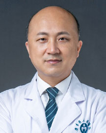

<!-- AUTO-GENERATED-BY: work/generate_obsidian_profiles.py -->

<!-- TEMPLATE: D:\workspace\信息收集整理\医生画像仓库\模板\医生画像模板.md -->

# 周苗

## 基础信息

| 字段 | 内容 |
|---|---|
| 姓名 | 周苗 |
| 医院 | 广东省人民医院 |
| 科室 | 口腔科门诊 |
| 职称/身份 | 主任医师 |
| 来源链接 | [官网原文](https://www.gdghospital.org.cn/Expertlistt/info_itemid_37943_subjectid_47.html) |
| 采集日期 | 2026-08-14 |

## 简介/擅长

口腔种植、颞下颌关节——牙颌面畸形和口腔颌面肿瘤、外伤和畸形等颌面外科疑难疾病的诊疗，曾在德国等地研修口腔种植、颞下颌关节与颌面外科

## 教育与进修经历

- 口腔颌面外科主任医师、博士、博士生导师、国际牙医师学院院士Fellow、毕业于北京大学、师从中华口腔医学会会长俞光岩教授，曾留学德国。

## 科研项目与成果

- 曾工作于国家级重点专科口腔颌面外科，目前是国际知名种植牙期刊杂志编委，国家自然科学基金评审专家，多本国内学术期刊审稿人，在国內外 (包括SCI)发表论文85篇，最高19.8， 2022 年获得中国最有影响力口腔学术论文 TOP 20。
- 3. 牙颌面畸形和外伤等的诊治，目前研究发现大量的牙颌面畸形患者与颞下颌关节疾病有关，我科聚焦这一项目，成立华南地区首个“颞下颌关节—牙颌面畸形”专科，对于地包天、面部偏斜、上颌前突、下颌过长、先天性疾病如唇腭裂造成的牙颌面畸形、牙槽突裂和口腔颌面部外伤等具有丰富的诊疗经验。

## 论文与学术产出

- 曾工作于国家级重点专科口腔颌面外科，目前是国际知名种植牙期刊杂志编委，国家自然科学基金评审专家，多本国内学术期刊审稿人，在国內外 (包括SCI)发表论文85篇，最高19.8， 2022 年获得中国最有影响力口腔学术论文 TOP 20。

## 可包装亮点

- 口腔颌面外科主任医师、博士、博士生导师、国际牙医师学院院士Fellow、毕业于北京大学、师从中华口腔医学会会长俞光岩教授，曾留学德国。
- 兼任中国生物医学工程学会组织工程与再生医学分会全国副主任委员、中华口腔医学会口腔颌面头颈专委会委员、中华口腔医学会颞下颌关节及合学专委会委员、第11届全国组织工程与再生医学大会执行主席、广东省生物医学工程学会生物3D打印与再生医学分会创会主任委员。
- 擅长口腔种植、颞下颌关节——牙颌面畸形和口腔颌面肿瘤、外伤和畸形等颌面外科疑难疾病的诊疗，曾在德国等地研修口腔种植、颞下颌关节与颌面外科；
- 曾工作于国家级重点专科口腔颌面外科，目前是国际知名种植牙期刊杂志编委，国家自然科学基金评审专家，多本国内学术期刊审稿人，在国內外 (包括SCI)发表论文85篇，最高19.8， 2022 年获得中国最有影响力口腔学术论文 TOP 20。

## 重点疾病/人群标签

- 慢性病：
- 肿瘤：肿瘤、癌、感染、疑难
- 生殖疾病：
- 免疫/风湿：肿瘤、癌、感染、疑难
- 术后恢复/康复：
- 疑难重症：肿瘤、癌、感染、疑难

## 证据摘录

> 只摘录官网公开信息中的短句或关键字段，不复制大段原文。

- 官网身份字段：主任医师
- 官网简介/擅长：口腔种植、颞下颌关节——牙颌面畸形和口腔颌面肿瘤、外伤和畸形等颌面外科疑难疾病的诊疗，曾在德国等地研修口腔种植、颞下颌关节与颌面外科
- 官网亮眼经历线索：口腔颌面外科主任医师、博士、博士生导师、国际牙医师学院院士Fellow、毕业于北京大学、师从中华口腔医学会会长俞光岩教授，曾留学德国。 兼任中国生物医学工程学会组织工程与再生医学分会全国副主任委员、中华口腔医学会口腔颌面头颈专委会委员、中华口腔医学会颞下颌关节及合学专委会委员、第11届全国组织工程与再生医学大会执行主席、广东省生物医学工程学会生物3D打印与再生医学分会创会主任委员。 擅长口腔种植、颞下颌关节——牙颌面畸形和口腔颌面肿瘤…
- 来源链接：https://www.gdghospital.org.cn/Expertlistt/info_itemid_37943_subjectid_47.html

## BD 画像摘要

周苗医生可作为肿瘤、免疫/风湿/感染、疑难重症方向的基础画像候选。后续 BD 使用应继续以官网来源和人工复核为准，不添加疗效承诺或无来源包装。

## 合规边界

- 仅使用医院官网、官方公众号、官方小程序等公开渠道。
- 不采集私人电话、私人微信、家庭住址、患者隐私或非公开排班信息。
- 不写“保证治愈”“疗效第一”“包治疑难杂症”等无法由官网证明的表述。
