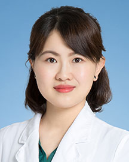

<!-- AUTO-GENERATED-BY: work/generate_obsidian_profiles.py -->

<!-- TEMPLATE: D:\workspace\信息收集整理\医生画像仓库\模板\医生画像模板.md -->

# 孙伟

## 基础信息

| 字段 | 内容 |
|---|---|
| 姓名 | 孙伟 |
| 医院 | 广东省人民医院 |
| 科室 | 眼科 |
| 职称/身份 | 副主任医师 |
| 来源链接 | [官网原文](https://www.gdghospital.org.cn/Expertlistt/info_itemid_43923_subjectid_46.html) |
| 采集日期 | 2026-08-14 |

## 简介/擅长

## 教育与进修经历

- 其他：成人及青少年干眼、白内障、眼底病等常见眼科疾病 简介 副主任医师，博士研究生，硕士生导师，毕业于中山大学中山眼科中心。
- 曾于印度LVPEI眼科中心交流，于北京同仁医院、天津眼科医院等医院进修学习。
- 作为省级师资，为基层培训相关的眼科人才数百人。

## 科研项目与成果

- 多次参加国际及国内会议发言，主持及参与国家自然科学基金及省级基金多项。

## 论文与学术产出

- 目前在眼科临床及基础研究领域，发表了SCI及核心期刊相关论著论文数十篇。

## 可包装亮点

- 博士研究生，硕士生导师 特长 眼整形：成人自然款重睑（双眼皮）、双眼皮整形失败病例的修复、眼周年轻化的综合治疗（内外路眼袋切除术联合泪沟填充、提眉、眼周注射、激光去皱除眼袋等）、眼周赘生物（眼部肿物、黄色瘤、色素痣、疣、皮赘、脂溢性角化、瘢痕等）尤其眼睑缘肿物的激光微创治疗、各种原因导致的上睑下垂（儿童及成人）、倒睫、先天性小睑裂综合症的治疗、顽固眼轮匝肌…
- 儿童眼病：儿童先天性上睑下垂、儿童先天性及后天性小眼球的超早期整形干预、斜弱视诊治、视网膜母细胞瘤的多学科治疗、早产儿视网膜病变及儿童遗传性眼病的诊治、青少年近视防控、视功能训练等。
- 其他：成人及青少年干眼、白内障、眼底病等常见眼科疾病 简介 副主任医师，博士研究生，硕士生导师，毕业于中山大学中山眼科中心。
- 现任：1、广东省保健协会视觉保健分会小儿眼病学组副组长；

## 重点疾病/人群标签

- 慢性病：
- 肿瘤：瘤、康复、多学科
- 生殖疾病：
- 免疫/风湿：
- 术后恢复/康复：瘤、康复、多学科
- 疑难重症：瘤、康复、多学科

## 证据摘录

> 只摘录官网公开信息中的短句或关键字段，不复制大段原文。

- 官网身份字段：副主任医师
- 官网亮眼经历线索：博士研究生，硕士生导师 特长 眼整形：成人自然款重睑（双眼皮）、双眼皮整形失败病例的修复、眼周年轻化的综合治疗（内外路眼袋切除术联合泪沟填充、提眉、眼周注射、激光去皱除眼袋等）、眼周赘生物（眼部肿物、黄色瘤、色素痣、疣、皮赘、脂溢性角化、瘢痕等）尤其眼睑缘肿物的激光微创治疗、各种原因导致的上睑下垂（儿童及成人）、倒睫、先天性小睑裂综合症的治疗、顽固眼轮匝肌痉挛（眼皮跳）的注射治疗等。 儿童眼病：儿童先天性上睑下垂、儿童先天性及后天性小…
- 来源链接：https://www.gdghospital.org.cn/Expertlistt/info_itemid_43923_subjectid_46.html

## BD 画像摘要

孙伟医生可作为肿瘤、术后恢复/康复、疑难重症方向的基础画像候选。后续 BD 使用应继续以官网来源和人工复核为准，不添加疗效承诺或无来源包装。

## 合规边界

- 仅使用医院官网、官方公众号、官方小程序等公开渠道。
- 不采集私人电话、私人微信、家庭住址、患者隐私或非公开排班信息。
- 不写“保证治愈”“疗效第一”“包治疑难杂症”等无法由官网证明的表述。
