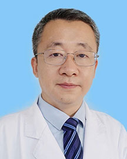

<!-- AUTO-GENERATED-BY: work/generate_obsidian_profiles.py -->

<!-- TEMPLATE: D:\workspace\信息收集整理\医生画像仓库\模板\医生画像模板.md -->

# 孙启全

## 基础信息

| 字段 | 内容 |
|---|---|
| 姓名 | 孙启全 |
| 医院 | 广东省人民医院 |
| 科室 | 肾移植科 |
| 职称/身份 | 教授、科主任 |
| 来源链接 | [官网原文](https://www.gdghospital.org.cn/Expertlistt/info_itemid_32780_subjectid_108.html) |
| 采集日期 | 2026-08-14 |

## 简介/擅长

肾移植疑难手术及相关并发症的处理，长期专注于术后排斥，尤其是抗体介导排斥反应的防治，对术后BK病毒感染、肺部感染和FSGS肾病等原发病复发的诊治具有丰富经验

## 科研项目与成果

- 相关成果纳入2部国际权威指南，在国际层面推动行业发展；
- 主持包括国家重点研发计划课题，国家自然科学基金在内的课题17项，总科研经费达2000万。
- 8次在美国和国际移植大会做口头报告，先后获国际移植学会青年学者奖、美国移植学会基础研究青年基金，2次获美国移植大会青年学者奖，具有国际影响力。

## 论文与学术产出

- 共发表学术论文100余篇，以第一或通讯作者发表含J Am Soc Nephrol、Kidney Int、J Heart Lung Transplant、Am J Transplant、Clin J Am Soc Nephrol、EBioMedicine、Transplantation等国际权威期刊在内的SCI 论文44篇；
- 参编包括美国移植学会官方教材在内的国际著作3部；
- 目前担任中华医学会器官移植学分会全国委员，曾经担任国际肾脏病学会青年工作委员会委员、继续教育委员会委员、2013世界肾脏病大会分会主席、Transplantation 等5家杂志编委、SCI期刊Clin & Develop Immunology 移植专刊客座主编，目前为包括Am J Transplant在内的7家国际期刊审稿人，曾受国际移植学会全球通报表彰。

## 可包装亮点

- 教授，研究员、肾移植科行政主任 国家级人才 广东省人民医院第一层次引进人才 国际肾脏病学会青年工作委员会（2011-2018） 执行委员 国际肾脏病学会北亚与区域委员会（2013-2018）执行委员 亚太肾脏病学会继续教育委员会（2013-2018） 执行委员 中华医学会器官移植学分会 全国委员 中国医师协会器官移植医师分会 全国委员 中国医药生物技术协会…
- 主刀肾移植手术超过1000台，擅长肾移植疑难手术及相关并发症的处理，长期专注于术后排斥，尤其是抗体介导排斥反应的防治，对术后BK病毒感染、肺部感染和FSGS肾病等原发病复发的诊治具有丰富经验。
- 共发表学术论文100余篇，以第一或通讯作者发表含J Am Soc Nephrol...

## 重点疾病/人群标签

- 慢性病：
- 肿瘤：
- 生殖疾病：
- 免疫/风湿：感染、术后、疑难
- 术后恢复/康复：感染、术后、疑难
- 疑难重症：感染、术后、疑难

## 证据摘录

> 只摘录官网公开信息中的短句或关键字段，不复制大段原文。

- 官网身份字段：教授、科主任
- 官网简介/擅长：肾移植疑难手术及相关并发症的处理，长期专注于术后排斥，尤其是抗体介导排斥反应的防治，对术后BK病毒感染、肺部感染和FSGS肾病等原发病复发的诊治具有丰富经验
- 官网亮眼经历线索：教授，研究员、肾移植科行政主任 国家级人才 广东省人民医院第一层次引进人才 国际肾脏病学会青年工作委员会（2011-2018） 执行委员 国际肾脏病学会北亚与区域委员会（2013-2018）执行委员 亚太肾脏病学会继续教育委员会（2013-2018） 执行委员 中华医学会器官移植学分会 全国委员 中国医师协会器官移植医师分会 全国委员 中国医药生物技术协会移植技术分会委员会 常务委员 中国生物医学工程学会透析移植分会委员会 常务委员…
- 来源链接：https://www.gdghospital.org.cn/Expertlistt/info_itemid_32780_subjectid_108.html

## BD 画像摘要

孙启全医生可作为免疫/风湿/感染、术后恢复/康复、疑难重症方向的基础画像候选。后续 BD 使用应继续以官网来源和人工复核为准，不添加疗效承诺或无来源包装。

## 合规边界

- 仅使用医院官网、官方公众号、官方小程序等公开渠道。
- 不采集私人电话、私人微信、家庭住址、患者隐私或非公开排班信息。
- 不写“保证治愈”“疗效第一”“包治疑难杂症”等无法由官网证明的表述。
