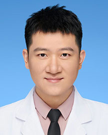

<!-- AUTO-GENERATED-BY: work/generate_obsidian_profiles.py -->

<!-- TEMPLATE: D:\workspace\信息收集整理\医生画像仓库\模板\医生画像模板.md -->

# 安云崧

## 基础信息

| 字段 | 内容 |
|---|---|
| 姓名 | 安云崧 |
| 医院 | 广东省人民医院 |
| 科室 | 鼻科 |
| 职称/身份 | 主治医师 |
| 来源链接 | [官网原文](https://www.gdghospital.org.cn/Expertlistt/info_itemid_58480_subjectid_110.html) |
| 采集日期 | 2026-08-14 |

## 简介/擅长

耳鼻喉头颈科常见疾病的规范诊治及微创治疗

## 教育与进修经历

- 博士毕业于首都医科大学附属北京同仁医院，师从于我国著名耳鼻喉头颈外科专家韩德民院士。

## 科研项目与成果

- 科研方面，参与国家科技部重大专项1项，国自然课题3项。
- 作为负责人，负责广东省市级课题等3项。

## 论文与学术产出

- 累计发表论著10余篇。

## 可包装亮点

- 截止到2024年，主要的社会任职包括：1.广东省医学会耳鼻咽喉分会青年委员会 副主任委员；
- 2.广东省精准医学会耳鼻喉分会常务委员 秘书长；
- 3.广东省预防医学会睡眠专委会 委员;
- 4. 广东省变态反应学会青年委员会 委员。

## 重点疾病/人群标签

- 慢性病：慢性、肿瘤、鼻咽癌
- 肿瘤：慢性、肿瘤、鼻咽癌
- 生殖疾病：
- 免疫/风湿：
- 术后恢复/康复：
- 疑难重症：

## 证据摘录

> 只摘录官网公开信息中的短句或关键字段，不复制大段原文。

- 官网身份字段：主治医师
- 官网简介/擅长：耳鼻喉头颈科常见疾病的规范诊治及微创治疗
- 官网亮眼经历线索：截止到2024年，主要的社会任职包括：1.广东省医学会耳鼻咽喉分会青年委员会 副主任委员； 2.广东省精准医学会耳鼻喉分会常务委员 秘书长； 3.广东省预防医学会睡眠专委会 委员; 4. 广东省变态反应学会青年委员会 委员。
- 来源链接：https://www.gdghospital.org.cn/Expertlistt/info_itemid_58480_subjectid_110.html

## BD 画像摘要

安云崧医生可作为慢性病、肿瘤方向的基础画像候选。后续 BD 使用应继续以官网来源和人工复核为准，不添加疗效承诺或无来源包装。

## 合规边界

- 仅使用医院官网、官方公众号、官方小程序等公开渠道。
- 不采集私人电话、私人微信、家庭住址、患者隐私或非公开排班信息。
- 不写“保证治愈”“疗效第一”“包治疑难杂症”等无法由官网证明的表述。
