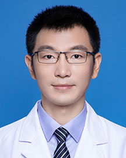

<!-- AUTO-GENERATED-BY: work/generate_obsidian_profiles.py -->

<!-- TEMPLATE: D:\workspace\信息收集整理\医生画像仓库\模板\医生画像模板.md -->

# 宋大龙

## 基础信息

| 字段 | 内容 |
|---|---|
| 姓名 | 宋大龙 |
| 医院 | 广东省人民医院 |
| 科室 | 妇科 |
| 职称/身份 | 医师 |
| 来源链接 | [官网原文](https://www.gdghospital.org.cn/Expertlistt/info_itemid_40412_subjectid_51.html) |
| 采集日期 | 2026-08-14 |

## 简介/擅长

妇科常见病的临床诊治和微创手术治疗，包括生殖道炎症、子宫内膜异位症、卵巢良恶性肿瘤、子宫肌瘤、宫颈良恶性病变、子宫内膜病变等

## 教育与进修经历

- 简介 医学博士，毕业于上海交通大学，从事妇产科临床工作多年。

## 科研项目与成果

- 荣誉奖项 主持国家自然科学基金和广州市基础与应用基础项目各1项，发表SCI论文多篇。

## 论文与学术产出

- 荣誉奖项 主持国家自然科学基金和广州市基础与应用基础项目各1项，发表SCI论文多篇。

## 可包装亮点

- 荣誉奖项 主持国家自然科学基金和广州市基础与应用基础项目各1项，发表SCI论文多篇。

## 重点疾病/人群标签

- 慢性病：
- 肿瘤：肿瘤、瘤、生殖、卵巢、妇科内分泌、月经
- 生殖疾病：肿瘤、瘤、生殖、卵巢、妇科内分泌、月经
- 免疫/风湿：
- 术后恢复/康复：
- 疑难重症：

## 证据摘录

> 只摘录官网公开信息中的短句或关键字段，不复制大段原文。

- 官网身份字段：医师
- 官网简介/擅长：妇科常见病的临床诊治和微创手术治疗，包括生殖道炎症、子宫内膜异位症、卵巢良恶性肿瘤、子宫肌瘤、宫颈良恶性病变、子宫内膜病变等
- 官网亮眼经历线索：荣誉奖项 主持国家自然科学基金和广州市基础与应用基础项目各1项，发表SCI论文多篇。
- 来源链接：https://www.gdghospital.org.cn/Expertlistt/info_itemid_40412_subjectid_51.html

## BD 画像摘要

宋大龙医生可作为肿瘤、生殖疾病方向的基础画像候选。后续 BD 使用应继续以官网来源和人工复核为准，不添加疗效承诺或无来源包装。

## 合规边界

- 仅使用医院官网、官方公众号、官方小程序等公开渠道。
- 不采集私人电话、私人微信、家庭住址、患者隐私或非公开排班信息。
- 不写“保证治愈”“疗效第一”“包治疑难杂症”等无法由官网证明的表述。
