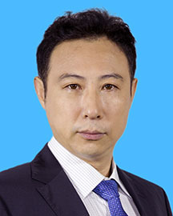

<!-- AUTO-GENERATED-BY: work/generate_obsidian_profiles.py -->

<!-- TEMPLATE: D:\workspace\信息收集整理\医生画像仓库\模板\医生画像模板.md -->

# 尹东

## 基础信息

| 字段 | 内容 |
|---|---|
| 姓名 | 尹东 |
| 医院 | 广东省人民医院 |
| 科室 | 脊柱外科 |
| 职称/身份 | 主任医师 |
| 来源链接 | [官网原文](https://www.gdghospital.org.cn/Expertlistt/info_itemid_24308_subjectid_48.html) |
| 采集日期 | 2026-08-14 |

## 简介/擅长

脊柱微创手术及脊柱侧弯、后凸等各种畸形的矫正手术，担任全国脊柱微创手术培训教师

## 教育与进修经历

- 医学博士、硕士研究生导师、中共党员 从事本专业30余年，先后到德国洪堡大学临床医院、美国迈阿密大学杰克逊纪念医院、波士顿大学医疗中心进修学习。
- 尤其擅长脊柱微创手术及脊柱侧弯、后凸等各种畸形的矫正手术，担任全国脊柱微创手术培训教师。

## 科研项目与成果

- 临床经验丰富，在国内外著名专业杂志发表临床研究成果论文30余篇，获国家发明专利、医疗成果奖及新技术奖多项。

## 论文与学术产出

- 临床经验丰富，在国内外著名专业杂志发表临床研究成果论文30余篇，获国家发明专利、医疗成果奖及新技术奖多项。

## 可包装亮点

- 医学博士、硕士研究生导师、中共党员 从事本专业30余年，先后到德国洪堡大学临床医院、美国迈阿密大学杰克逊纪念医院、波士顿大学医疗中心进修学习。
- 临床经验丰富，在国内外著名专业杂志发表临床研究成果论文30余篇，获国家发明专利、医疗成果奖及新技术奖多项。
- 中国医师协会骨科医师分会脊柱微创融合学组和科普学组委员 中国研究型医院学会脊柱外科分会委员 SICOT中国部数字骨科学会委员 广东省医学会骨科学分会常务委员 广东省康复医学会骨科学分会常务委员 广东省医疗行业协会脊柱外科专业委员会副主任委员 广州抗癌学会脊柱肿瘤专业委员会副主任委员

## 重点疾病/人群标签

- 慢性病：
- 肿瘤：肿瘤、癌、强直性脊柱炎、康复
- 生殖疾病：
- 免疫/风湿：肿瘤、癌、强直性脊柱炎、康复
- 术后恢复/康复：肿瘤、癌、强直性脊柱炎、康复
- 疑难重症：

## 证据摘录

> 只摘录官网公开信息中的短句或关键字段，不复制大段原文。

- 官网身份字段：主任医师
- 官网简介/擅长：脊柱微创手术及脊柱侧弯、后凸等各种畸形的矫正手术，担任全国脊柱微创手术培训教师
- 官网亮眼经历线索：医学博士、硕士研究生导师、中共党员 从事本专业30余年，先后到德国洪堡大学临床医院、美国迈阿密大学杰克逊纪念医院、波士顿大学医疗中心进修学习。 临床经验丰富，在国内外著名专业杂志发表临床研究成果论文30余篇，获国家发明专利、医疗成果奖及新技术奖多项。 中国医师协会骨科医师分会脊柱微创融合学组和科普学组委员 中国研究型医院学会脊柱外科分会委员 SICOT中国部数字骨科学会委员 广东省医学会骨科学分会常务委员 广东省康复医学会骨科学分会常…
- 来源链接：https://www.gdghospital.org.cn/Expertlistt/info_itemid_24308_subjectid_48.html

## BD 画像摘要

尹东医生可作为肿瘤、免疫/风湿/感染、术后恢复/康复方向的基础画像候选。后续 BD 使用应继续以官网来源和人工复核为准，不添加疗效承诺或无来源包装。

## 合规边界

- 仅使用医院官网、官方公众号、官方小程序等公开渠道。
- 不采集私人电话、私人微信、家庭住址、患者隐私或非公开排班信息。
- 不写“保证治愈”“疗效第一”“包治疑难杂症”等无法由官网证明的表述。
