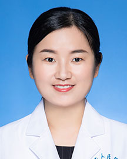

<!-- AUTO-GENERATED-BY: work/generate_obsidian_profiles.py -->

<!-- TEMPLATE: D:\workspace\信息收集整理\医生画像仓库\模板\医生画像模板.md -->

# 崔倩

## 基础信息

| 字段 | 内容 |
|---|---|
| 姓名 | 崔倩 |
| 医院 | 广东省人民医院 |
| 科室 | 病理科 |
| 职称/身份 | 主管技师 |
| 来源链接 | [官网原文](https://www.gdghospital.org.cn/Expertlistt/info_itemid_25308_subjectid_59.html) |
| 采集日期 | 2026-08-14 |

## 简介/擅长

## 教育与进修经历

- 博士毕业于中山大学肿瘤防治中心分子医学专业，博士期间在哈佛大学附属波士顿儿童医院交流访学三个月。

## 科研项目与成果

- 第一及共一作者发表SCI论文多篇，主持国家自然科学基金青年基金一项，广东省医学科研基金两项。

## 论文与学术产出

- 第一及共一作者发表SCI论文多篇，主持国家自然科学基金青年基金一项，广东省医学科研基金两项。

## 可包装亮点

- 学会任职 ：中国抗癌协会肿瘤病理分子协作组成员、中国医学装备协会基因检测分会委员、广东省临床病理医疗质量控制中心分子病理质控组成员、广东省精准医学应用学会分子病理分会秘书、广东省精准医学应用学会临床生物信息分会常委、广东省基层医药学会细胞病理与分子诊断专委会分子技术学组副组长。
- 第一及共一作者发表SCI论文多篇，主持国家自然科学基金青年基金一项，广东省医学科研基金两项。

## 重点疾病/人群标签

- 慢性病：
- 肿瘤：
- 生殖疾病：
- 免疫/风湿：
- 术后恢复/康复：
- 疑难重症：

## 证据摘录

> 只摘录官网公开信息中的短句或关键字段，不复制大段原文。

- 官网身份字段：主管技师
- 官网亮眼经历线索：学会任职 ：中国抗癌协会肿瘤病理分子协作组成员、中国医学装备协会基因检测分会委员、广东省临床病理医疗质量控制中心分子病理质控组成员、广东省精准医学应用学会分子病理分会秘书、广东省精准医学应用学会临床生物信息分会常委、广东省基层医药学会细胞病理与分子诊断专委会分子技术学组副组长。 第一及共一作者发表SCI论文多篇，主持国家自然科学基金青年基金一项，广东省医学科研基金两项。
- 异常提示：职称/身份需人工复核
- 来源链接：https://www.gdghospital.org.cn/Expertlistt/info_itemid_25308_subjectid_59.html

## BD 画像摘要

崔倩医生可作为广东省人民医院病理科的基础医生资料入库。当前重点方向以总底表标签为准，官网未展示的信息保持空白。

## 合规边界

- 仅使用医院官网、官方公众号、官方小程序等公开渠道。
- 不采集私人电话、私人微信、家庭住址、患者隐私或非公开排班信息。
- 不写“保证治愈”“疗效第一”“包治疑难杂症”等无法由官网证明的表述。
