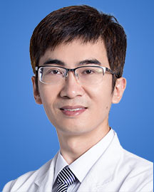

<!-- AUTO-GENERATED-BY: work/generate_obsidian_profiles.py -->

<!-- TEMPLATE: D:\workspace\信息收集整理\医生画像仓库\模板\医生画像模板.md -->

# 崔勇

## 基础信息

| 字段 | 内容 |
|---|---|
| 姓名 | 崔勇 |
| 医院 | 广东省人民医院 |
| 科室 | 耳科 |
| 职称/身份 | 主任医师 科主任 |
| 来源链接 | [官网原文](https://www.gdghospital.org.cn/Expertlistt/info_itemid_24941_subjectid_109.html) |
| 采集日期 | 2026-08-14 |

## 简介/擅长

耳外科领域： 1. 人工耳蜗手术，尤其是各种疑难病例的诊断和手术

## 教育与进修经历

- 简介 教育背景： 1999-2004年 硕博毕业于复旦大学（原上海医科大学），师从中科院院士王正敏教授；
- 2007~2008年于日本有“私立大学之雄”之称的庆应大学医学部留学，师从小川郁教授；

## 可包装亮点

- 专长 耳外科领域： 1. 人工耳蜗手术，尤其是各种疑难病例的诊断和手术；
- 广东省生物医学工程协会耳鼻喉科分会前任主任委员；
- 广东省医学会前庭分会 副主任委员 广东省医学会耳鼻咽喉头颈外科分会 委员 荣誉奖励 国际学术声望： 近十余年来，频繁受邀至美国，意大利，日本，韩国，中国台湾，中国香港等国家和地区讲学及操作演示： 1.2025.4 阿联酋迪拜 第一届世界咽鼓管研究及干预大会 2. 2023.10 中国上海 第十一届世界胆脂瘤大会 3. 2019.10 日本山形，日本耳科年会…
- 4. 2019.6 美国波士顿，第三届世界耳内镜大会（国际委员兼中国区主席）；

## 重点疾病/人群标签

- 慢性病：慢性、肿瘤、瘤、生殖、试管、疑难
- 肿瘤：慢性、肿瘤、瘤、生殖、试管、疑难
- 生殖疾病：慢性、肿瘤、瘤、生殖、试管、疑难
- 免疫/风湿：
- 术后恢复/康复：
- 疑难重症：慢性、肿瘤、瘤、生殖、试管、疑难

## 证据摘录

> 只摘录官网公开信息中的短句或关键字段，不复制大段原文。

- 官网身份字段：主任医师 科主任
- 官网简介/擅长：耳外科领域： 1. 人工耳蜗手术，尤其是各种疑难病例的诊断和手术
- 官网亮眼经历线索：专长 耳外科领域： 1. 人工耳蜗手术，尤其是各种疑难病例的诊断和手术； 广东省生物医学工程协会耳鼻喉科分会前任主任委员； 广东省医学会前庭分会 副主任委员 广东省医学会耳鼻咽喉头颈外科分会 委员 荣誉奖励 国际学术声望： 近十余年来，频繁受邀至美国，意大利，日本，韩国，中国台湾，中国香港等国家和地区讲学及操作演示： 1.2025.4 阿联酋迪拜 第一届世界咽鼓管研究及干预大会 2. 2023.10 中国上海 第十一届世界胆脂瘤大会…
- 来源链接：https://www.gdghospital.org.cn/Expertlistt/info_itemid_24941_subjectid_109.html

## BD 画像摘要

崔勇医生可作为慢性病、肿瘤、生殖疾病、疑难重症方向的基础画像候选。后续 BD 使用应继续以官网来源和人工复核为准，不添加疗效承诺或无来源包装。

## 合规边界

- 仅使用医院官网、官方公众号、官方小程序等公开渠道。
- 不采集私人电话、私人微信、家庭住址、患者隐私或非公开排班信息。
- 不写“保证治愈”“疗效第一”“包治疑难杂症”等无法由官网证明的表述。
