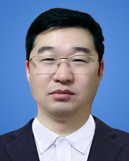

<!-- AUTO-GENERATED-BY: work/generate_obsidian_profiles.py -->

<!-- TEMPLATE: D:\workspace\信息收集整理\医生画像仓库\模板\医生画像模板.md -->

# 崔建修

## 基础信息

| 字段 | 内容 |
|---|---|
| 姓名 | 崔建修 |
| 医院 | 广东省人民医院 |
| 科室 | 麻醉科 |
| 职称/身份 | 主任医师 |
| 来源链接 | [官网原文](https://www.gdghospital.org.cn/Expertlistt/info_itemid_55491_subjectid_13.html) |
| 采集日期 | 2026-08-14 |

## 简介/擅长

擅长胸部外科手术、危急重症及有高血压、糖尿病等合并症患者的手术麻醉，尤其 擅长肺癌新辅助治疗后微创手术患者麻醉及完全无管肺部手术麻醉

## 科研项目与成果

- 承 担广东省自然科学基金、广东省科技计划项目等科研项目七项，发表包括SCI论文 在内的麻醉学专业论文三十余篇。

## 论文与学术产出

- 承 担广东省自然科学基金、广东省科技计划项目等科研项目七项，发表包括SCI论文 在内的麻醉学专业论文三十余篇。

## 可包装亮点

- 简介 南方医科大学、汕头大学客座教授，硕士研究生导师，中国心胸血管麻 醉学会胸科分会全国委员，广东省精准医学应用学会精准麻醉分会副主任委员。
- 承 担广东省自然科学基金、广东省科技计划项目等科研项目七项，发表包括SCI论文 在内的麻醉学专业论文三十余篇。

## 重点疾病/人群标签

- 慢性病：高血压、糖尿病、肺癌、重症
- 肿瘤：高血压、糖尿病、肺癌、重症
- 生殖疾病：
- 免疫/风湿：
- 术后恢复/康复：
- 疑难重症：高血压、糖尿病、肺癌、重症

## 证据摘录

> 只摘录官网公开信息中的短句或关键字段，不复制大段原文。

- 官网身份字段：主任医师
- 官网简介/擅长：擅长胸部外科手术、危急重症及有高血压、糖尿病等合并症患者的手术麻醉，尤其 擅长肺癌新辅助治疗后微创手术患者麻醉及完全无管肺部手术麻醉
- 官网亮眼经历线索：简介 南方医科大学、汕头大学客座教授，硕士研究生导师，中国心胸血管麻 醉学会胸科分会全国委员，广东省精准医学应用学会精准麻醉分会副主任委员。 承 担广东省自然科学基金、广东省科技计划项目等科研项目七项，发表包括SCI论文 在内的麻醉学专业论文三十余篇。
- 来源链接：https://www.gdghospital.org.cn/Expertlistt/info_itemid_55491_subjectid_13.html

## BD 画像摘要

崔建修医生可作为慢性病、肿瘤、疑难重症方向的基础画像候选。后续 BD 使用应继续以官网来源和人工复核为准，不添加疗效承诺或无来源包装。

## 合规边界

- 仅使用医院官网、官方公众号、官方小程序等公开渠道。
- 不采集私人电话、私人微信、家庭住址、患者隐私或非公开排班信息。
- 不写“保证治愈”“疗效第一”“包治疑难杂症”等无法由官网证明的表述。
