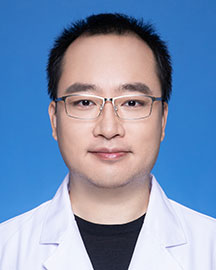

<!-- AUTO-GENERATED-BY: work/generate_obsidian_profiles.py -->

<!-- TEMPLATE: D:\workspace\信息收集整理\医生画像仓库\模板\医生画像模板.md -->

# 崔灿

## 基础信息

| 字段 | 内容 |
|---|---|
| 姓名 | 崔灿 |
| 医院 | 广东省人民医院 |
| 科室 | 麻醉科 |
| 职称/身份 | 副主任医师 |
| 来源链接 | [官网原文](https://www.gdghospital.org.cn/Expertlistt/info_itemid_60225_subjectid_13.html) |
| 采集日期 | 2026-08-14 |

## 简介/擅长

熟练掌握各种疼痛常见病的诊治，如头痛、颈肩腰腿痛、神经痛（三叉神经痛、带状疱疹后遗神经痛等）、术后疼痛综合征、癌痛等

## 教育与进修经历

- 本科毕业于华中科技大学同济医学院，硕士毕业于南方医科大学。

## 科研项目与成果

- 主持省级科研项目1项，发表论文10余篇，其中SCI收录5篇，授权实用新型专利4项。

## 论文与学术产出

- 主持省级科研项目1项，发表论文10余篇，其中SCI收录5篇，授权实用新型专利4项。

## 可包装亮点

- 担任中华医学会广东省疼痛学分会委员，广东省康复医学会腰腿痛专业委员会委员，广东省医院协会疼痛科管理专业委员会委员，广东省医学教育学会麻醉专业委员会委员。
- 主持省级科研项目1项，发表论文10余篇，其中SCI收录5篇，授权实用新型专利4项。
- 荣誉奖励 获得中国医师协会2017年度全国“住院医师心中好老师”称号。

## 重点疾病/人群标签

- 慢性病：
- 肿瘤：癌、术后、康复、疼痛
- 生殖疾病：
- 免疫/风湿：
- 术后恢复/康复：癌、术后、康复、疼痛
- 疑难重症：

## 证据摘录

> 只摘录官网公开信息中的短句或关键字段，不复制大段原文。

- 官网身份字段：副主任医师
- 官网简介/擅长：熟练掌握各种疼痛常见病的诊治，如头痛、颈肩腰腿痛、神经痛（三叉神经痛、带状疱疹后遗神经痛等）、术后疼痛综合征、癌痛等
- 官网亮眼经历线索：担任中华医学会广东省疼痛学分会委员，广东省康复医学会腰腿痛专业委员会委员，广东省医院协会疼痛科管理专业委员会委员，广东省医学教育学会麻醉专业委员会委员。 主持省级科研项目1项，发表论文10余篇，其中SCI收录5篇，授权实用新型专利4项。 荣誉奖励 获得中国医师协会2017年度全国“住院医师心中好老师”称号。
- 来源链接：https://www.gdghospital.org.cn/Expertlistt/info_itemid_60225_subjectid_13.html

## BD 画像摘要

崔灿医生可作为肿瘤、术后恢复/康复方向的基础画像候选。后续 BD 使用应继续以官网来源和人工复核为准，不添加疗效承诺或无来源包装。

## 合规边界

- 仅使用医院官网、官方公众号、官方小程序等公开渠道。
- 不采集私人电话、私人微信、家庭住址、患者隐私或非公开排班信息。
- 不写“保证治愈”“疗效第一”“包治疑难杂症”等无法由官网证明的表述。
