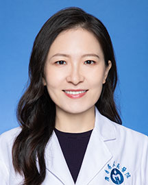

<!-- AUTO-GENERATED-BY: work/generate_obsidian_profiles.py -->

<!-- TEMPLATE: D:\workspace\信息收集整理\医生画像仓库\模板\医生画像模板.md -->

# 崔颖

## 基础信息

| 字段 | 内容 |
|---|---|
| 姓名 | 崔颖 |
| 医院 | 广东省人民医院 |
| 科室 | 眼科 |
| 职称/身份 | 主任医师 |
| 来源链接 | [官网原文](https://www.gdghospital.org.cn/Expertlistt/info_itemid_24992_subjectid_46.html) |
| 采集日期 | 2026-08-14 |

## 简介/擅长

白内障、糖尿病眼病的诊治

## 教育与进修经历

- 医学博士、眼科副主任（主持工作） 美国哈佛大学医学院博士后，哈佛大学Karp fellowship， 美国视觉与眼科研究协会会员，广东省医师协会青年委员会委员，广东省防盲指导技术组成员，广东省眼健康协会中西医结合专业委员会委员。

## 科研项目与成果

- 医学博士、眼科副主任（主持工作） 美国哈佛大学医学院博士后，哈佛大学Karp fellowship， 美国视觉与眼科研究协会会员，广东省医师协会青年委员会委员，广东省防盲指导技术组成员，广东省眼健康协会中西医结合专业委员会委员。
- 主持参与多项国家及省级科研课题，以第一作者身份发表文章二十余篇，其中SCI收录十余篇。

## 论文与学术产出

- 主持参与多项国家及省级科研课题，以第一作者身份发表文章二十余篇，其中SCI收录十余篇。

## 可包装亮点

- 医学博士、眼科副主任（主持工作） 美国哈佛大学医学院博士后，哈佛大学Karp fellowship， 美国视觉与眼科研究协会会员，广东省医师协会青年委员会委员，广东省防盲指导技术组成员，广东省眼健康协会中西医结合专业委员会委员。
- 主持参与多项国家及省级科研课题，以第一作者身份发表文章二十余篇，其中SCI收录十余篇。

## 重点疾病/人群标签

- 慢性病：糖尿病
- 肿瘤：
- 生殖疾病：
- 免疫/风湿：
- 术后恢复/康复：
- 疑难重症：

## 证据摘录

> 只摘录官网公开信息中的短句或关键字段，不复制大段原文。

- 官网身份字段：主任医师
- 官网简介/擅长：白内障、糖尿病眼病的诊治
- 官网亮眼经历线索：医学博士、眼科副主任（主持工作） 美国哈佛大学医学院博士后，哈佛大学Karp fellowship， 美国视觉与眼科研究协会会员，广东省医师协会青年委员会委员，广东省防盲指导技术组成员，广东省眼健康协会中西医结合专业委员会委员。 主持参与多项国家及省级科研课题，以第一作者身份发表文章二十余篇，其中SCI收录十余篇。
- 来源链接：https://www.gdghospital.org.cn/Expertlistt/info_itemid_24992_subjectid_46.html

## BD 画像摘要

崔颖医生可作为慢性病方向的基础画像候选。后续 BD 使用应继续以官网来源和人工复核为准，不添加疗效承诺或无来源包装。

## 合规边界

- 仅使用医院官网、官方公众号、官方小程序等公开渠道。
- 不采集私人电话、私人微信、家庭住址、患者隐私或非公开排班信息。
- 不写“保证治愈”“疗效第一”“包治疑难杂症”等无法由官网证明的表述。
