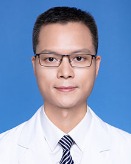

<!-- AUTO-GENERATED-BY: work/generate_obsidian_profiles.py -->

<!-- TEMPLATE: D:\workspace\信息收集整理\医生画像仓库\模板\医生画像模板.md -->

# 巫林伟

## 基础信息

| 字段 | 内容 |
|---|---|
| 姓名 | 巫林伟 |
| 医院 | 广东省人民医院 |
| 科室 | 器官移植科 |
| 职称/身份 | 主任医师 |
| 来源链接 | [官网原文](https://www.gdghospital.org.cn/Expertlistt/info_itemid_25558_subjectid_12.html) |
| 采集日期 | 2026-08-14 |

## 简介/擅长

## 科研项目与成果

- 学术专业领域成就 ： 作为主要技术骨干参与完成的课题获得国家科技进步二等奖，广东省科技进步一等奖（两项），中华医学一等奖以及中山大学芙兰奖一项。
- 主持国家自然科学基金等各级课题10余项，第一作者与通讯作者发表SCI论著近30篇，包括Hepatology，Elife，Cell death & diseases等高水平杂志，参与研究的课题已经发表在Cancer Cell，Cell Stem Cell，blood等国际顶级杂志上。

## 论文与学术产出

- 主持国家自然科学基金等各级课题10余项，第一作者与通讯作者发表SCI论著近30篇，包括Hepatology，Elife，Cell death & diseases等高水平杂志，参与研究的课题已经发表在Cancer Cell，Cell Stem Cell，blood等国际顶级杂志上。

## 可包装亮点

- 医学博士、博士生导师 社会兼职和任职 ： 中华医学会器官移植分会第六届青年委员 广东省肝脏病学会器官移植专业委员会第四届副主任委员 教育经历和专业特长 ： 中山大学外科学博士（普通外科）。
- 2007年赴香港大学附属玛丽医院学习活体肝移植技术，2013年9月赴美国UT Southwestern Medical Center进行为期2年的肝病研究工作，2016年受聘为主任医师。
- 2020年8月以高层次人才引进广东省人民医院从事肝胆外科及肝移植工作。
- 学术专业领域成就 ： 作为主要技术骨干参与完成的课题获得国家科技进步二等奖，广东省科技进步一等奖（两项），中华医学一等奖以及中山大学芙兰奖一项。

## 重点疾病/人群标签

- 慢性病：
- 肿瘤：肿瘤
- 生殖疾病：
- 免疫/风湿：
- 术后恢复/康复：
- 疑难重症：

## 证据摘录

> 只摘录官网公开信息中的短句或关键字段，不复制大段原文。

- 官网身份字段：主任医师
- 官网亮眼经历线索：医学博士、博士生导师 社会兼职和任职 ： 中华医学会器官移植分会第六届青年委员 广东省肝脏病学会器官移植专业委员会第四届副主任委员 教育经历和专业特长 ： 中山大学外科学博士（普通外科）。 2007年赴香港大学附属玛丽医院学习活体肝移植技术，2013年9月赴美国UT Southwestern Medical Center进行为期2年的肝病研究工作，2016年受聘为主任医师。 2020年8月以高层次人才引进广东省人民医院从事肝胆外科及肝…
- 来源链接：https://www.gdghospital.org.cn/Expertlistt/info_itemid_25558_subjectid_12.html

## BD 画像摘要

巫林伟医生可作为肿瘤方向的基础画像候选。后续 BD 使用应继续以官网来源和人工复核为准，不添加疗效承诺或无来源包装。

## 合规边界

- 仅使用医院官网、官方公众号、官方小程序等公开渠道。
- 不采集私人电话、私人微信、家庭住址、患者隐私或非公开排班信息。
- 不写“保证治愈”“疗效第一”“包治疑难杂症”等无法由官网证明的表述。
