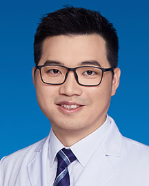

<!-- AUTO-GENERATED-BY: work/generate_obsidian_profiles.py -->

<!-- TEMPLATE: D:\workspace\信息收集整理\医生画像仓库\模板\医生画像模板.md -->

# 廖亚帝

## 基础信息

| 字段 | 内容 |
|---|---|
| 姓名 | 廖亚帝 |
| 医院 | 广东省人民医院 |
| 科室 | 肝胆外科 |
| 职称/身份 | 主治医师 |
| 来源链接 | [官网原文](https://www.gdghospital.org.cn/Expertlistt/info_itemid_48259_subjectid_105.html) |
| 采集日期 | 2026-08-14 |

## 简介/擅长

肝胆外科相关疾病的临床诊治与基础研究，擅长腹腔镜微创手术、肝胆肿瘤综合治 疗以及超声引导下肿瘤消融手术和各类穿刺置管术

## 教育与进修经历

- 简介 肿瘤学博士，博士后，主治医师。
- 2010年本科毕业于中山医学院临床医学 系，2015年博士毕业于中山大学肿瘤防治中心，从事肝胆外科工作13年，具有较 丰富的临床经验，擅长微创手术治疗肝胆相关疾病，尤其擅长运用超声引导进行肿 瘤消融治疗。

## 论文与学术产出

- 荣誉奖励 参编专著：《超声引导下肝脏外科手术图解》，以第一作者或共同第一作者发表 SCI论文多篇。

## 可包装亮点

- 目前兼任广东省肿瘤康复学会肝胆胰分会委员，广东省卫生信息网络 协会肝胆胰外科数字医学应用分会委员，广东省生物医学工程学会生物3D打印与 再生医学分会委员等职。
- 荣誉奖励 参编专著：《超声引导下肝脏外科手术图解》，以第一作者或共同第一作者发表 SCI论文多篇。

## 重点疾病/人群标签

- 慢性病：慢性、肿瘤、癌、瘤、肝癌、感染、康复
- 肿瘤：慢性、肿瘤、癌、瘤、肝癌、感染、康复
- 生殖疾病：
- 免疫/风湿：慢性、肿瘤、癌、瘤、肝癌、感染、康复
- 术后恢复/康复：慢性、肿瘤、癌、瘤、肝癌、感染、康复
- 疑难重症：

## 证据摘录

> 只摘录官网公开信息中的短句或关键字段，不复制大段原文。

- 官网身份字段：主治医师
- 官网简介/擅长：肝胆外科相关疾病的临床诊治与基础研究，擅长腹腔镜微创手术、肝胆肿瘤综合治 疗以及超声引导下肿瘤消融手术和各类穿刺置管术
- 官网亮眼经历线索：目前兼任广东省肿瘤康复学会肝胆胰分会委员，广东省卫生信息网络 协会肝胆胰外科数字医学应用分会委员，广东省生物医学工程学会生物3D打印与 再生医学分会委员等职。 荣誉奖励 参编专著：《超声引导下肝脏外科手术图解》，以第一作者或共同第一作者发表 SCI论文多篇。
- 来源链接：https://www.gdghospital.org.cn/Expertlistt/info_itemid_48259_subjectid_105.html

## BD 画像摘要

廖亚帝医生可作为慢性病、肿瘤、免疫/风湿/感染、术后恢复/康复方向的基础画像候选。后续 BD 使用应继续以官网来源和人工复核为准，不添加疗效承诺或无来源包装。

## 合规边界

- 仅使用医院官网、官方公众号、官方小程序等公开渠道。
- 不采集私人电话、私人微信、家庭住址、患者隐私或非公开排班信息。
- 不写“保证治愈”“疗效第一”“包治疑难杂症”等无法由官网证明的表述。
