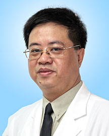

<!-- AUTO-GENERATED-BY: work/generate_obsidian_profiles.py -->

<!-- TEMPLATE: D:\workspace\信息收集整理\医生画像仓库\模板\医生画像模板.md -->

# 廖俊星

## 基础信息

| 字段 | 内容 |
|---|---|
| 姓名 | 廖俊星 |
| 医院 | 广东省人民医院 |
| 科室 | 关节骨病与创伤科 |
| 职称/身份 | 副主任医师 |
| 来源链接 | [官网原文](https://www.gdghospital.org.cn/Expertlistt/info_itemid_24829_subjectid_49.html) |
| 采集日期 | 2026-08-14 |

## 简介/擅长

于各种关节疾病的外科治疗，包括成人的各种关节疾病，小儿关节外科及骨关节创伤等，尤其是各种人工关节置换，如髋、膝关节置换手术近5年每年在300例左右

## 教育与进修经历

- 曾多次到国外进行学术访问及会议交流，先后二次在法国及德国长时间留学进修，学习了解目前国际上先进的关节外科技术及发展动态。

## 科研项目与成果

- 科研成果 主持省厅级在研科技项目2项，在国内核心杂志发表学术论文十余篇。

## 论文与学术产出

- 科研成果 主持省厅级在研科技项目2项，在国内核心杂志发表学术论文十余篇。

## 可包装亮点

- 曾多次到国外进行学术访问及会议交流，先后二次在法国及德国长时间留学进修，学习了解目前国际上先进的关节外科技术及发展动态。
- 科研成果 主持省厅级在研科技项目2项，在国内核心杂志发表学术论文十余篇。
- 学术任职 现任广东省医学会关节外科委员 专家

## 重点疾病/人群标签

- 慢性病：
- 肿瘤：
- 生殖疾病：
- 免疫/风湿：
- 术后恢复/康复：
- 疑难重症：

## 证据摘录

> 只摘录官网公开信息中的短句或关键字段，不复制大段原文。

- 官网身份字段：副主任医师
- 官网简介/擅长：于各种关节疾病的外科治疗，包括成人的各种关节疾病，小儿关节外科及骨关节创伤等，尤其是各种人工关节置换，如髋、膝关节置换手术近5年每年在300例左右
- 官网亮眼经历线索：曾多次到国外进行学术访问及会议交流，先后二次在法国及德国长时间留学进修，学习了解目前国际上先进的关节外科技术及发展动态。 科研成果 主持省厅级在研科技项目2项，在国内核心杂志发表学术论文十余篇。 学术任职 现任广东省医学会关节外科委员 专家
- 来源链接：https://www.gdghospital.org.cn/Expertlistt/info_itemid_24829_subjectid_49.html

## BD 画像摘要

廖俊星医生可作为广东省人民医院关节骨病与创伤科的基础医生资料入库。当前重点方向以总底表标签为准，官网未展示的信息保持空白。

## 合规边界

- 仅使用医院官网、官方公众号、官方小程序等公开渠道。
- 不采集私人电话、私人微信、家庭住址、患者隐私或非公开排班信息。
- 不写“保证治愈”“疗效第一”“包治疑难杂症”等无法由官网证明的表述。
