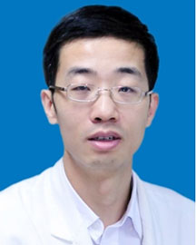

<!-- AUTO-GENERATED-BY: work/generate_obsidian_profiles.py -->

<!-- TEMPLATE: D:\workspace\信息收集整理\医生画像仓库\模板\医生画像模板.md -->

# 廖洪涛

## 基础信息

| 字段 | 内容 |
|---|---|
| 姓名 | 廖洪涛 |
| 医院 | 广东省人民医院 |
| 科室 | 心血管内科 |
| 职称/身份 | 副主任医师 |
| 来源链接 | [官网原文](https://www.gdghospital.org.cn/Expertlistt/info_itemid_25546_subjectid_79.html) |
| 采集日期 | 2026-08-14 |

## 简介/擅长

擅长房颤、室上速、室速等心律失常经导管消融，冠脉慢性闭塞、左主干、分叉等复杂病变的介入治疗，以及心脏起搏器植入、心脏再同步治疗等

## 科研项目与成果

- 学会任职： 中国生物医学工程学会心律分会青年委员会副主任委员，中华医学会心电生理和起搏分会青年委员会委员，广东省医学会心血管病分会起搏与电生理青年委员会副主任委员，广东省医师协会起搏与电生理专业医师分会委员，广东省医师协会心脏重症专业医师分会委员，广东省中西医结合学会心律失常专业委员会常委 学术成果： 主持广东省科技计划项目一项，第一作者或通信作者身份发表SCI论文数篇，获专利一项，曾获“广东省科学技术二等奖”。

## 论文与学术产出

- 学会任职： 中国生物医学工程学会心律分会青年委员会副主任委员，中华医学会心电生理和起搏分会青年委员会委员，广东省医学会心血管病分会起搏与电生理青年委员会副主任委员，广东省医师协会起搏与电生理专业医师分会委员，广东省医师协会心脏重症专业医师分会委员，广东省中西医结合学会心律失常专业委员会常委 学术成果： 主持广东省科技计划项目一项，第一作者或通信作者身份发表SCI论文数篇，获专利一项，曾获“广东省科学技术二等奖”。

## 可包装亮点

- 心内二区副主任，医学博士，硕士生导师 长期从事心血管疾病诊治临床工作、主要研究方向为经导管射频消融术、起搏器植入术、冠心病介入。
- 一直从事心血管疾病的诊治工作，对常见心血管疾病及心血管危重症抢救有丰富的经验。
- 曾在在德国圣乔治医院、美国加州大学洛杉矶分校和芝加哥大学医院学习复杂心律失常射频消融。
- 学会任职： 中国生物医学工程学会心律分会青年委员会副主任委员，中华医学会心电生理和起搏分会青年委员会委员，广东省医学会心血管病分会起搏与电生理青年委员会副主任委员，广东省医师协会起搏与电生理专业医师分会委员，广东省医师协会心脏重症专业医师分会委员，广东省中西医结合学会心律失常专业委员会常委 学术成果： 主持广东省科技计划项目一项，第一作者或通信作者身份发表…

## 重点疾病/人群标签

- 慢性病：冠心病、慢性、危重、重症、复杂
- 肿瘤：
- 生殖疾病：
- 免疫/风湿：
- 术后恢复/康复：
- 疑难重症：冠心病、慢性、危重、重症、复杂

## 证据摘录

> 只摘录官网公开信息中的短句或关键字段，不复制大段原文。

- 官网身份字段：副主任医师
- 官网简介/擅长：擅长房颤、室上速、室速等心律失常经导管消融，冠脉慢性闭塞、左主干、分叉等复杂病变的介入治疗，以及心脏起搏器植入、心脏再同步治疗等
- 官网亮眼经历线索：心内二区副主任，医学博士，硕士生导师 长期从事心血管疾病诊治临床工作、主要研究方向为经导管射频消融术、起搏器植入术、冠心病介入。 一直从事心血管疾病的诊治工作，对常见心血管疾病及心血管危重症抢救有丰富的经验。 曾在在德国圣乔治医院、美国加州大学洛杉矶分校和芝加哥大学医院学习复杂心律失常射频消融。 学会任职： 中国生物医学工程学会心律分会青年委员会副主任委员，中华医学会心电生理和起搏分会青年委员会委员，广东省医学会心血管病分会起搏与电生…
- 来源链接：https://www.gdghospital.org.cn/Expertlistt/info_itemid_25546_subjectid_79.html

## BD 画像摘要

廖洪涛医生可作为慢性病、疑难重症方向的基础画像候选。后续 BD 使用应继续以官网来源和人工复核为准，不添加疗效承诺或无来源包装。

## 合规边界

- 仅使用医院官网、官方公众号、官方小程序等公开渠道。
- 不采集私人电话、私人微信、家庭住址、患者隐私或非公开排班信息。
- 不写“保证治愈”“疗效第一”“包治疑难杂症”等无法由官网证明的表述。
