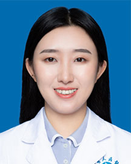

<!-- AUTO-GENERATED-BY: work/generate_obsidian_profiles.py -->

<!-- TEMPLATE: D:\workspace\信息收集整理\医生画像仓库\模板\医生画像模板.md -->

# 张一辰

## 基础信息

| 字段 | 内容 |
|---|---|
| 姓名 | 张一辰 |
| 医院 | 广东省人民医院 |
| 科室 | 肺内一科 |
| 职称/身份 | 医师 |
| 来源链接 | [官网原文](https://www.gdghospital.org.cn/Expertlistt/info_itemid_33915_subjectid_24.html) |
| 采集日期 | 2026-08-14 |

## 简介/擅长

肺癌靶向治疗、免疫 治疗等肺癌个体化治疗

## 论文与学术产出

- 以第一作者发表 SCI 文章 6 篇，担任广东省基层医药协 会肺癌专业委员会秘书长。

## 可包装亮点

- 2016 年 12 月获世 界肺癌协会国际导师培养奖，于法国古斯塔夫鲁西肿瘤医院交流，2017 年于美国 访学开展克服靶向治疗耐药研究。
- 2019 年 -2020 年于广东省肺癌研究所完成肺 癌内科学、放射治疗学及外科学的肺癌多学科诊疗训练。
- 以第一作者发表 SCI 文章 6 篇，担任广东省基层医药协 会肺癌专业委员会秘书长。

## 重点疾病/人群标签

- 慢性病：
- 肿瘤：肿瘤、癌、靶向、肺癌、免疫、多学科
- 生殖疾病：
- 免疫/风湿：肿瘤、癌、靶向、肺癌、免疫、多学科
- 术后恢复/康复：
- 疑难重症：肿瘤、癌、靶向、肺癌、免疫、多学科

## 证据摘录

> 只摘录官网公开信息中的短句或关键字段，不复制大段原文。

- 官网身份字段：医师
- 官网简介/擅长：肺癌靶向治疗、免疫 治疗等肺癌个体化治疗
- 官网亮眼经历线索：2016 年 12 月获世 界肺癌协会国际导师培养奖，于法国古斯塔夫鲁西肿瘤医院交流，2017 年于美国 访学开展克服靶向治疗耐药研究。 2019 年 -2020 年于广东省肺癌研究所完成肺 癌内科学、放射治疗学及外科学的肺癌多学科诊疗训练。 以第一作者发表 SCI 文章 6 篇，担任广东省基层医药协 会肺癌专业委员会秘书长。
- 来源链接：https://www.gdghospital.org.cn/Expertlistt/info_itemid_33915_subjectid_24.html

## BD 画像摘要

张一辰医生可作为肿瘤、免疫/风湿/感染、疑难重症方向的基础画像候选。后续 BD 使用应继续以官网来源和人工复核为准，不添加疗效承诺或无来源包装。

## 合规边界

- 仅使用医院官网、官方公众号、官方小程序等公开渠道。
- 不采集私人电话、私人微信、家庭住址、患者隐私或非公开排班信息。
- 不写“保证治愈”“疗效第一”“包治疑难杂症”等无法由官网证明的表述。
