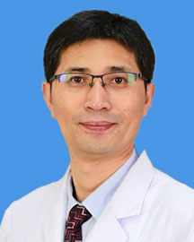

<!-- AUTO-GENERATED-BY: work/generate_obsidian_profiles.py -->

<!-- TEMPLATE: D:\workspace\信息收集整理\医生画像仓库\模板\医生画像模板.md -->

# 张余

## 基础信息

| 字段 | 内容 |
|---|---|
| 姓名 | 张余 |
| 医院 | 广东省人民医院 |
| 科室 | 骨肿瘤科 |
| 职称/身份 | 主任医师 科室主任 |
| 来源链接 | [官网原文](https://www.gdghospital.org.cn/Expertlistt/info_itemid_25552_subjectid_50.html) |
| 采集日期 | 2026-08-14 |

## 简介/擅长

## 教育与进修经历

- 中共党员，博士，博士生导师、博士后合作导师，哈佛大学访问学者 主要社会兼职 中国抗癌协会肿瘤微创治疗专业委员会骨与软组织肿瘤学组主任委员 中国医师协会骨科分会骨肿瘤专业委员会委员 中国抗癌协会肉瘤专业委员会委员 中国生物材料学会医用金属材料分会秘书长 广东省精准医学应用学会骨肿瘤分会主任委员， 广东省医师协会骨肿瘤专业委员会副主任委员， 广东省医学工程学会医疗机器人与人工智能专业委员会副主任委员， 《中华关节外科杂志》、《实用医学》、《研究生学报》、等杂志编委 研究方向 骨肿瘤个性化诊疗、肺癌骨转移综合治疗、微波…
- 自2009年，完成近千例的临床应用及随访工作，发表相关论文20篇，于2018年，建立了国家级临床技术培训基地，组织撰写了第一本“微波消融治疗骨肿瘤”培训教材，于2019年，提出“微波活性氧”理论，为微波治疗骨肿瘤后续研究及临床应用做出了新的尝试。

## 科研项目与成果

- 科研成果 以第一作者或者通讯作者发表论文近200篇，其中SCI收录论文百余篇，主持国家“十三五”、“十四五”重点研发计划课题、国家自然科学基金面上项目、省自然团队项目等近20项，研究经费近3000万，第一完成人及第二完成人获得省部级二等奖2项。

## 论文与学术产出

- 科研成果 以第一作者或者通讯作者发表论文近200篇，其中SCI收录论文百余篇，主持国家“十三五”、“十四五”重点研发计划课题、国家自然科学基金面上项目、省自然团队项目等近20项，研究经费近3000万，第一完成人及第二完成人获得省部级二等奖2项。
- 自2015年开始，团队在运动医学、关节矫形领域顶级期刊发表系列文章十余篇，其中3篇发表在AJSM杂志。
- 自2009年，完成近千例的临床应用及随访工作，发表相关论文20篇，于2018年，建立了国家级临床技术培训基地，组织撰写了第一本“微波消融治疗骨肿瘤”培训教材，于2019年，提出“微波活性氧”理论，为微波治疗骨肿瘤后续研究及临床应用做出了新的尝试。

## 可包装亮点

- 中共党员，博士，博士生导师、博士后合作导师，哈佛大学访问学者 主要社会兼职 中国抗癌协会肿瘤微创治疗专业委员会骨与软组织肿瘤学组主任委员 中国医师协会骨科分会骨肿瘤专业委员会委员 中国抗癌协会肉瘤专业委员会委员 中国生物材料学会医用金属材料分会秘书长 广东省精准医学应用学会骨肿瘤分会主任委员， 广东省医师协会骨肿瘤专业委员会副主任委员， 广东省医学工程学会…
- 科研成果 以第一作者或者通讯作者发表论文近200篇，其中SCI收录论文百余篇，主持国家“十三五”、“十四五”重点研发计划课题、国家自然科学基金面上项目、省自然团队项目等近20项，研究经费近3000万，第一完成人及第二完成人获得省部级二等奖2项。
- 自2015年开始，团队...

## 重点疾病/人群标签

- 慢性病：
- 肿瘤：肿瘤、癌、瘤、肺癌、疑难
- 生殖疾病：
- 免疫/风湿：
- 术后恢复/康复：
- 疑难重症：肿瘤、癌、瘤、肺癌、疑难

## 证据摘录

> 只摘录官网公开信息中的短句或关键字段，不复制大段原文。

- 官网身份字段：主任医师 科室主任
- 官网亮眼经历线索：中共党员，博士，博士生导师、博士后合作导师，哈佛大学访问学者 主要社会兼职 中国抗癌协会肿瘤微创治疗专业委员会骨与软组织肿瘤学组主任委员 中国医师协会骨科分会骨肿瘤专业委员会委员 中国抗癌协会肉瘤专业委员会委员 中国生物材料学会医用金属材料分会秘书长 广东省精准医学应用学会骨肿瘤分会主任委员， 广东省医师协会骨肿瘤专业委员会副主任委员， 广东省医学工程学会医疗机器人与人工智能专业委员会副主任委员， 《中华关节外科杂志》、《实用医学》…
- 来源链接：https://www.gdghospital.org.cn/Expertlistt/info_itemid_25552_subjectid_50.html

## BD 画像摘要

张余医生可作为肿瘤、疑难重症方向的基础画像候选。后续 BD 使用应继续以官网来源和人工复核为准，不添加疗效承诺或无来源包装。

## 合规边界

- 仅使用医院官网、官方公众号、官方小程序等公开渠道。
- 不采集私人电话、私人微信、家庭住址、患者隐私或非公开排班信息。
- 不写“保证治愈”“疗效第一”“包治疑难杂症”等无法由官网证明的表述。
