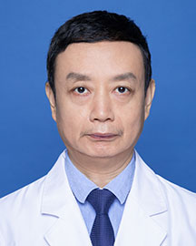

<!-- AUTO-GENERATED-BY: work/generate_obsidian_profiles.py -->

<!-- TEMPLATE: D:\workspace\信息收集整理\医生画像仓库\模板\医生画像模板.md -->

# 张健

## 基础信息

| 字段 | 内容 |
|---|---|
| 姓名 | 张健 |
| 医院 | 广东省人民医院 |
| 科室 | 普通儿科 |
| 职称/身份 | 副主任医师 |
| 来源链接 | [官网原文](https://www.gdghospital.org.cn/Expertlistt/info_itemid_25011_subjectid_55.html) |
| 采集日期 | 2026-08-14 |

## 简介/擅长

儿童过敏引起的哮喘、过敏性鼻炎、荨麻疹和过敏性紫癜

## 教育与进修经历

- 于1986年毕业于中山医科大学，在广东省人民医院从事儿科工作30多年，临床经验丰富，参与过多项临床研究，并在医学杂志上发表过多篇论文。

## 科研项目与成果

- 近来对儿童过敏性疾病进行了深入的研究，有重大研究成果，并于医学杂志上发表了研究成果。

## 论文与学术产出

- 于1986年毕业于中山医科大学，在广东省人民医院从事儿科工作30多年，临床经验丰富，参与过多项临床研究，并在医学杂志上发表过多篇论文。
- 近来对儿童过敏性疾病进行了深入的研究，有重大研究成果，并于医学杂志上发表了研究成果。

## 可包装亮点

- 于1986年毕业于中山医科大学，在广东省人民医院从事儿科工作30多年，临床经验丰富，参与过多项临床研究，并在医学杂志上发表过多篇论文。
- 近来对儿童过敏性疾病进行了深入的研究，有重大研究成果，并于医学杂志上发表了研究成果。

## 重点疾病/人群标签

- 慢性病：
- 肿瘤：
- 生殖疾病：
- 免疫/风湿：
- 术后恢复/康复：
- 疑难重症：

## 证据摘录

> 只摘录官网公开信息中的短句或关键字段，不复制大段原文。

- 官网身份字段：副主任医师
- 官网简介/擅长：儿童过敏引起的哮喘、过敏性鼻炎、荨麻疹和过敏性紫癜
- 官网亮眼经历线索：于1986年毕业于中山医科大学，在广东省人民医院从事儿科工作30多年，临床经验丰富，参与过多项临床研究，并在医学杂志上发表过多篇论文。 近来对儿童过敏性疾病进行了深入的研究，有重大研究成果，并于医学杂志上发表了研究成果。
- 来源链接：https://www.gdghospital.org.cn/Expertlistt/info_itemid_25011_subjectid_55.html

## BD 画像摘要

张健医生可作为广东省人民医院普通儿科的基础医生资料入库。当前重点方向以总底表标签为准，官网未展示的信息保持空白。

## 合规边界

- 仅使用医院官网、官方公众号、官方小程序等公开渠道。
- 不采集私人电话、私人微信、家庭住址、患者隐私或非公开排班信息。
- 不写“保证治愈”“疗效第一”“包治疑难杂症”等无法由官网证明的表述。
