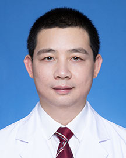

<!-- AUTO-GENERATED-BY: work/generate_obsidian_profiles.py -->

<!-- TEMPLATE: D:\workspace\信息收集整理\医生画像仓库\模板\医生画像模板.md -->

# 张勇

## 基础信息

| 字段 | 内容 |
|---|---|
| 姓名 | 张勇 |
| 医院 | 广东省人民医院 |
| 科室 | 心外科 |
| 职称/身份 | 副主任医师 |
| 来源链接 | [官网原文](https://www.gdghospital.org.cn/Expertlistt/info_itemid_24375_subjectid_80.html) |
| 采集日期 | 2026-08-14 |

## 简介/擅长

先心病一站式微创外科手术，肺动脉瓣微创外科植入修复，瓣膜疾病微创治疗，全超声引导可吸收封堵器微创封堵，腋下切口超快通道微创外科手术治疗，胸腔镜微创外科手术，胸骨下端微创外科手术，单一切口微创外科手术治疗，先心病再次外科干预手术治疗，无射线损伤微创封堵，瓣膜疾病微创治疗，孕产妇先心病围生期外科手术治疗，外科起搏器植入治疗，复杂先心病一站式外科治疗，婴幼儿先心病产前产后一体化外科治疗，心血管快速康复外科管理

## 教育与进修经历

- 有丰富的心脏病外科手术经验，参与多项国家及省级课题，获中华医学会优秀论文三等奖，曾在瑞典林雪平大学医学院进修学习。

## 科研项目与成果

- 有丰富的心脏病外科手术经验，参与多项国家及省级课题，获中华医学会优秀论文三等奖，曾在瑞典林雪平大学医学院进修学习。

## 论文与学术产出

- 有丰富的心脏病外科手术经验，参与多项国家及省级课题，获中华医学会优秀论文三等奖，曾在瑞典林雪平大学医学院进修学习。

## 可包装亮点

- 羊城好医生。
- 现任广东省心血管病研究所心外科副主任医师,广东省医学会心血管外科分会青年委员，广东省医师协会小儿外科分会第三届委员，南方医科大学 华南理工大学本科课程授课教师。
- 有丰富的心脏病外科手术经验，参与多项国家及省级课题，获中华医学会优秀论文三等奖，曾在瑞典林雪平大学医学院进修学习。

## 重点疾病/人群标签

- 慢性病：
- 肿瘤：
- 生殖疾病：
- 免疫/风湿：
- 术后恢复/康复：康复、复杂
- 疑难重症：康复、复杂

## 证据摘录

> 只摘录官网公开信息中的短句或关键字段，不复制大段原文。

- 官网身份字段：副主任医师
- 官网简介/擅长：先心病一站式微创外科手术，肺动脉瓣微创外科植入修复，瓣膜疾病微创治疗，全超声引导可吸收封堵器微创封堵，腋下切口超快通道微创外科手术治疗，胸腔镜微创外科手术，胸骨下端微创外科手术，单一切口微创外科手术治疗，先心病再次外科干预手术治疗，无射线损伤微创封堵，瓣膜疾病微创治疗，孕产妇先心病围生期外科手术治疗，外科起搏器植入治疗，复杂先心病一站式外科治疗，婴幼儿先心病产前产后一体化外科治疗，心血管快速康复外科管理
- 官网亮眼经历线索：羊城好医生。 现任广东省心血管病研究所心外科副主任医师,广东省医学会心血管外科分会青年委员，广东省医师协会小儿外科分会第三届委员，南方医科大学 华南理工大学本科课程授课教师。 有丰富的心脏病外科手术经验，参与多项国家及省级课题，获中华医学会优秀论文三等奖，曾在瑞典林雪平大学医学院进修学习。
- 来源链接：https://www.gdghospital.org.cn/Expertlistt/info_itemid_24375_subjectid_80.html

## BD 画像摘要

张勇医生可作为术后恢复/康复、疑难重症方向的基础画像候选。后续 BD 使用应继续以官网来源和人工复核为准，不添加疗效承诺或无来源包装。

## 合规边界

- 仅使用医院官网、官方公众号、官方小程序等公开渠道。
- 不采集私人电话、私人微信、家庭住址、患者隐私或非公开排班信息。
- 不写“保证治愈”“疗效第一”“包治疑难杂症”等无法由官网证明的表述。
