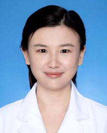

<!-- AUTO-GENERATED-BY: work/generate_obsidian_profiles.py -->

<!-- TEMPLATE: D:\workspace\信息收集整理\医生画像仓库\模板\医生画像模板.md -->

# 张娟

## 基础信息

| 字段 | 内容 |
|---|---|
| 姓名 | 张娟 |
| 医院 | 广东省人民医院 |
| 科室 | 检验科 |
| 职称/身份 | 主管技师 |
| 来源链接 | [官网原文](https://www.gdghospital.org.cn/Expertlistt/info_itemid_54420_subjectid_60.html) |
| 采集日期 | 2026-08-14 |

## 简介/擅长

## 教育与进修经历

- 2013年毕业于中南大学湘雅医学院，检验科临检凝血组质量负责人，临床检验、实验室管理和标准化建设方面具有丰富的理论和实践经验，在国内外核心期刊发表论文多篇。

## 科研项目与成果

- 2013年毕业于中南大学湘雅医学院，检验科临检凝血组质量负责人，临床检验、实验室管理和标准化建设方面具有丰富的理论和实践经验，在国内外核心期刊发表论文多篇。
- 广东省卫生信息网络协会智慧检验分会常务委员、广东省人类遗传资源保藏应用学会实验室标准与认证认可专业委员会委员、广东省医用耗材管理学会检验与体外诊断分会委员。

## 论文与学术产出

- 2013年毕业于中南大学湘雅医学院，检验科临检凝血组质量负责人，临床检验、实验室管理和标准化建设方面具有丰富的理论和实践经验，在国内外核心期刊发表论文多篇。

## 可包装亮点

- 2013年毕业于中南大学湘雅医学院，检验科临检凝血组质量负责人，临床检验、实验室管理和标准化建设方面具有丰富的理论和实践经验，在国内外核心期刊发表论文多篇。
- 广东省卫生信息网络协会智慧检验分会常务委员、广东省人类遗传资源保藏应用学会实验室标准与认证认可专业委员会委员、广东省医用耗材管理学会检验与体外诊断分会委员。

## 重点疾病/人群标签

- 慢性病：
- 肿瘤：
- 生殖疾病：
- 免疫/风湿：
- 术后恢复/康复：
- 疑难重症：

## 证据摘录

> 只摘录官网公开信息中的短句或关键字段，不复制大段原文。

- 官网身份字段：主管技师
- 官网亮眼经历线索：2013年毕业于中南大学湘雅医学院，检验科临检凝血组质量负责人，临床检验、实验室管理和标准化建设方面具有丰富的理论和实践经验，在国内外核心期刊发表论文多篇。 广东省卫生信息网络协会智慧检验分会常务委员、广东省人类遗传资源保藏应用学会实验室标准与认证认可专业委员会委员、广东省医用耗材管理学会检验与体外诊断分会委员。
- 异常提示：职称/身份需人工复核
- 来源链接：https://www.gdghospital.org.cn/Expertlistt/info_itemid_54420_subjectid_60.html

## BD 画像摘要

张娟医生可作为广东省人民医院检验科的基础医生资料入库。当前重点方向以总底表标签为准，官网未展示的信息保持空白。

## 合规边界

- 仅使用医院官网、官方公众号、官方小程序等公开渠道。
- 不采集私人电话、私人微信、家庭住址、患者隐私或非公开排班信息。
- 不写“保证治愈”“疗效第一”“包治疑难杂症”等无法由官网证明的表述。
