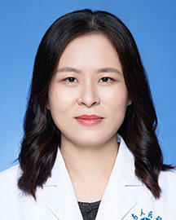

<!-- AUTO-GENERATED-BY: work/generate_obsidian_profiles.py -->

<!-- TEMPLATE: D:\workspace\信息收集整理\医生画像仓库\模板\医生画像模板.md -->

# 张宇昕

## 基础信息

| 字段 | 内容 |
|---|---|
| 姓名 | 张宇昕 |
| 医院 | 广东省人民医院 |
| 科室 | 普通儿科 |
| 职称/身份 | 主任医师 |
| 来源链接 | [官网原文](https://www.gdghospital.org.cn/Expertlistt/info_itemid_25008_subjectid_55.html) |
| 采集日期 | 2026-08-14 |

## 简介/擅长

儿科神经系统疾病、癫痫、脑电图、中枢神经系统感染、神经系统遗传代谢性疾病的的诊治

## 教育与进修经历

- 儿科学在读博士，儿科副主任、普儿科主任 1996年毕业于中山医科大学。

## 科研项目与成果

- 参与研究广东省重点科技攻关课题及国家自然课题多项，主持省级课题2项，获广东省科学技术奖二等奖。

## 可包装亮点

- 儿科学在读博士，儿科副主任、普儿科主任 1996年毕业于中山医科大学。
- 参与研究广东省重点科技攻关课题及国家自然课题多项，主持省级课题2项，获广东省科学技术奖二等奖。
- 学术任职：广东省抗癫痫协会理事，广东省小儿神经学组副组长，广东省医学会妇幼保健学组副组长，广东省医师协会儿科委员。
- 2009年获广东省科学技术进步二等奖。

## 重点疾病/人群标签

- 慢性病：代谢、感染
- 肿瘤：
- 生殖疾病：
- 免疫/风湿：代谢、感染
- 术后恢复/康复：
- 疑难重症：

## 证据摘录

> 只摘录官网公开信息中的短句或关键字段，不复制大段原文。

- 官网身份字段：主任医师
- 官网简介/擅长：儿科神经系统疾病、癫痫、脑电图、中枢神经系统感染、神经系统遗传代谢性疾病的的诊治
- 官网亮眼经历线索：儿科学在读博士，儿科副主任、普儿科主任 1996年毕业于中山医科大学。 参与研究广东省重点科技攻关课题及国家自然课题多项，主持省级课题2项，获广东省科学技术奖二等奖。 学术任职：广东省抗癫痫协会理事，广东省小儿神经学组副组长，广东省医学会妇幼保健学组副组长，广东省医师协会儿科委员。 2009年获广东省科学技术进步二等奖。
- 来源链接：https://www.gdghospital.org.cn/Expertlistt/info_itemid_25008_subjectid_55.html

## BD 画像摘要

张宇昕医生可作为慢性病、免疫/风湿/感染方向的基础画像候选。后续 BD 使用应继续以官网来源和人工复核为准，不添加疗效承诺或无来源包装。

## 合规边界

- 仅使用医院官网、官方公众号、官方小程序等公开渠道。
- 不采集私人电话、私人微信、家庭住址、患者隐私或非公开排班信息。
- 不写“保证治愈”“疗效第一”“包治疑难杂症”等无法由官网证明的表述。
