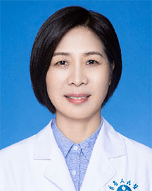

<!-- AUTO-GENERATED-BY: work/generate_obsidian_profiles.py -->

<!-- TEMPLATE: D:\workspace\信息收集整理\医生画像仓库\模板\医生画像模板.md -->

# 张庆玲

## 基础信息

| 字段 | 内容 |
|---|---|
| 姓名 | 张庆玲 |
| 医院 | 广东省人民医院 |
| 科室 | 病理科 |
| 职称/身份 | 教授 科主任 |
| 来源链接 | [官网原文](https://www.gdghospital.org.cn/Expertlistt/info_itemid_33483_subjectid_59.html) |
| 采集日期 | 2026-08-14 |

## 简介/擅长

## 教育与进修经历

- 教授，医学博士 博士生导师，博士后合作导师 广东省人民医院 病理科/国家临床重点专科 主任 药学技诊第六党支部 支部书记 中国医师协会病理科医师分会 常委 中华医学会病理学分会 国际交流合作工作委员会 委员 中国研究型医院学会病理学专委会 常委 广东省精准医学应用学会 常务理事兼分子病理分会主任委员 广东省医学会病理学分会 副主任委员 广东省医疗保障医药服务临床专家 中国抗癌协会肿瘤微环境专业委员会 常委 中国抗癌协会肿瘤病理专委会 淋巴瘤学组成员 MD安德森肿瘤中心分子细胞肿瘤系和血液病理学系访问学者 主持国家…

## 科研项目与成果

- 牵头制定国内首个分子病理实验室建设规范领域的团体标准《医疗机构分子病理实验室建设规范》。
- 主编教材1部，参编教材2部，发明专利1项。

## 论文与学术产出

- 发表论文80余篇，被引4436余次，累计影响因子434.301，H指数23。
- 主编教材1部，参编教材2部，发明专利1项。

## 可包装亮点

- 教授，医学博士 博士生导师，博士后合作导师 广东省人民医院 病理科/国家临床重点专科 主任 药学技诊第六党支部 支部书记 中国医师协会病理科医师分会 常委 中华医学会病理学分会 国际交流合作工作委员会 委员 中国研究型医院学会病理学专委会 常委 广东省精准医学应用学会 常务理事兼分子病理分会主任委员 广东省医学会病理学分会 副主任委员 广东省医疗保障医药服…
- 发表论文80余篇，被引4436余次，累计影响因子434.301，H指数23。
- 牵头制定国内首个分子病理实验室建设规范领域的团体标准《医疗机构分子病理实验室建设规范》。
- 主编教材1部，参编教材2部，发明专利1项。

## 重点疾病/人群标签

- 慢性病：
- 肿瘤：肿瘤、癌、淋巴瘤
- 生殖疾病：
- 免疫/风湿：
- 术后恢复/康复：
- 疑难重症：

## 证据摘录

> 只摘录官网公开信息中的短句或关键字段，不复制大段原文。

- 官网身份字段：教授 科主任
- 官网亮眼经历线索：教授，医学博士 博士生导师，博士后合作导师 广东省人民医院 病理科/国家临床重点专科 主任 药学技诊第六党支部 支部书记 中国医师协会病理科医师分会 常委 中华医学会病理学分会 国际交流合作工作委员会 委员 中国研究型医院学会病理学专委会 常委 广东省精准医学应用学会 常务理事兼分子病理分会主任委员 广东省医学会病理学分会 副主任委员 广东省医疗保障医药服务临床专家 中国抗癌协会肿瘤微环境专业委员会 常委 中国抗癌协会肿瘤病理专委会…
- 来源链接：https://www.gdghospital.org.cn/Expertlistt/info_itemid_33483_subjectid_59.html

## BD 画像摘要

张庆玲医生可作为肿瘤方向的基础画像候选。后续 BD 使用应继续以官网来源和人工复核为准，不添加疗效承诺或无来源包装。

## 合规边界

- 仅使用医院官网、官方公众号、官方小程序等公开渠道。
- 不采集私人电话、私人微信、家庭住址、患者隐私或非公开排班信息。
- 不写“保证治愈”“疗效第一”“包治疑难杂症”等无法由官网证明的表述。
