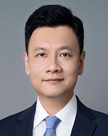

<!-- AUTO-GENERATED-BY: work/generate_obsidian_profiles.py -->

<!-- TEMPLATE: D:\workspace\信息收集整理\医生画像仓库\模板\医生画像模板.md -->

# 张弩

## 基础信息

| 字段 | 内容 |
|---|---|
| 姓名 | 张弩 |
| 医院 | 广东省人民医院 |
| 科室 | 神经外科 |
| 职称/身份 | 教授 主任医师 |
| 来源链接 | [官网原文](https://www.gdghospital.org.cn/Expertlistt/info_itemid_64695_subjectid_11.html) |
| 采集日期 | 2026-08-14 |

## 简介/擅长

领域 全面掌握神经外科常见病与多发病的诊治，主攻方向为以手术为核心的各类胶质瘤新型临床试验与颅底显微神经外科

## 可包装亮点

- 个人简介 教授、主任医师、博士研究生导师；
- 神经外科学科带头人；
- 中华医学会神经外科分会青年委员、中国医师协会常委、神经肿瘤学组副组长、广东省医学会神经外科分会副主委等。

## 重点疾病/人群标签

- 慢性病：
- 肿瘤：肿瘤、瘤
- 生殖疾病：
- 免疫/风湿：
- 术后恢复/康复：
- 疑难重症：

## 证据摘录

> 只摘录官网公开信息中的短句或关键字段，不复制大段原文。

- 官网身份字段：教授 主任医师
- 官网简介/擅长：领域 全面掌握神经外科常见病与多发病的诊治，主攻方向为以手术为核心的各类胶质瘤新型临床试验与颅底显微神经外科
- 官网亮眼经历线索：个人简介 教授、主任医师、博士研究生导师； 神经外科学科带头人； 中华医学会神经外科分会青年委员、中国医师协会常委、神经肿瘤学组副组长、广东省医学会神经外科分会副主委等。
- 来源链接：https://www.gdghospital.org.cn/Expertlistt/info_itemid_64695_subjectid_11.html

## BD 画像摘要

张弩医生可作为肿瘤方向的基础画像候选。后续 BD 使用应继续以官网来源和人工复核为准，不添加疗效承诺或无来源包装。

## 合规边界

- 仅使用医院官网、官方公众号、官方小程序等公开渠道。
- 不采集私人电话、私人微信、家庭住址、患者隐私或非公开排班信息。
- 不写“保证治愈”“疗效第一”“包治疑难杂症”等无法由官网证明的表述。
