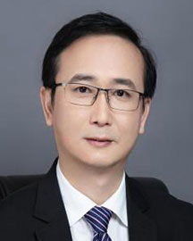

<!-- AUTO-GENERATED-BY: work/generate_obsidian_profiles.py -->

<!-- TEMPLATE: D:\workspace\信息收集整理\医生画像仓库\模板\医生画像模板.md -->

# 张思毅

## 基础信息

| 字段 | 内容 |
|---|---|
| 姓名 | 张思毅 |
| 医院 | 广东省人民医院 |
| 科室 | 咽喉头颈外科 |
| 职称/身份 | 主任医师 |
| 来源链接 | [官网原文](https://www.gdghospital.org.cn/Expertlistt/info_itemid_24946_subjectid_45.html) |
| 采集日期 | 2026-08-14 |

## 简介/擅长

咽喉、头颈肿瘤（包括甲状腺、腮腺等）及鼾症的外科治疗

## 教育与进修经历

- 博士、博士研究生导师、博士后合作导师 1983-1989年中山医科大学学士 1997-2000年澳大利亚西澳大学硕士 2010-2013年南方医科大学博士 从事耳鼻咽喉临床工作30多年，擅长咽喉、头颈肿瘤（包括甲状腺、腮腺等）及鼾症的外科治疗。

## 科研项目与成果

- 主持及参与国家、省市等科研项目多项。

## 可包装亮点

- 广东省医师协会头颈肿瘤分会主委（现任） 广东省中华医学会耳鼻咽喉科分会副主委（现任） 广东省医师协会耳鼻咽喉头颈外科分会副主委（现任） 广东省研究型医院学会耳鼻咽喉分会副主委（现任） 广东省抗癌协会头颈肿瘤分会常委。
- （现任） 广东省健康管理协会耳鼻咽喉分会常委（现任） 广东省医师协会睡眠医学分会第1、2届副主委 广东省中西医结合耳鼻咽喉分会第1、2、3届副主委 曾获评“羊城好医生”，“岭南名医”等称号。

## 重点疾病/人群标签

- 慢性病：
- 肿瘤：肿瘤、癌
- 生殖疾病：
- 免疫/风湿：
- 术后恢复/康复：
- 疑难重症：

## 证据摘录

> 只摘录官网公开信息中的短句或关键字段，不复制大段原文。

- 官网身份字段：主任医师
- 官网简介/擅长：咽喉、头颈肿瘤（包括甲状腺、腮腺等）及鼾症的外科治疗
- 官网亮眼经历线索：广东省医师协会头颈肿瘤分会主委（现任） 广东省中华医学会耳鼻咽喉科分会副主委（现任） 广东省医师协会耳鼻咽喉头颈外科分会副主委（现任） 广东省研究型医院学会耳鼻咽喉分会副主委（现任） 广东省抗癌协会头颈肿瘤分会常委。 （现任） 广东省健康管理协会耳鼻咽喉分会常委（现任） 广东省医师协会睡眠医学分会第1、2届副主委 广东省中西医结合耳鼻咽喉分会第1、2、3届副主委 曾获评“羊城好医生”，“岭南名医”等称号。
- 来源链接：https://www.gdghospital.org.cn/Expertlistt/info_itemid_24946_subjectid_45.html

## BD 画像摘要

张思毅医生可作为肿瘤方向的基础画像候选。后续 BD 使用应继续以官网来源和人工复核为准，不添加疗效承诺或无来源包装。

## 合规边界

- 仅使用医院官网、官方公众号、官方小程序等公开渠道。
- 不采集私人电话、私人微信、家庭住址、患者隐私或非公开排班信息。
- 不写“保证治愈”“疗效第一”“包治疑难杂症”等无法由官网证明的表述。
