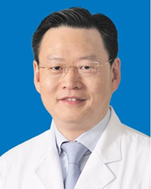

<!-- AUTO-GENERATED-BY: work/generate_obsidian_profiles.py -->

<!-- TEMPLATE: D:\workspace\信息收集整理\医生画像仓库\模板\医生画像模板.md -->

# 张斌

## 基础信息

| 字段 | 内容 |
|---|---|
| 姓名 | 张斌 |
| 医院 | 广东省人民医院 |
| 科室 | 心血管内科 |
| 职称/身份 | 主任医师 |
| 来源链接 | [官网原文](https://www.gdghospital.org.cn/Expertlistt/info_itemid_25494_subjectid_79.html) |
| 采集日期 | 2026-08-14 |

## 简介/擅长

于冠心病的介入治疗，有着丰富的经验和娴熟的手术技巧

## 教育与进修经历

- 卫生部心血管疾病介入诊疗培训基地（冠心病介入治疗）导师。

## 科研项目与成果

- 研究成果 主要研究方向为应用分子生物学方法研究急性冠脉综合症的发病机理，研究冠状动脉粥样斑块的稳定性，防治动脉粥样斑块早期破裂。
- 曾在国内外杂志发表论文60余篇，曾担任2项广东省重点攻关项目的主要成员，主持广东省自然科学基金、广东省科技计划项目和广东省卫生厅科研项目。

## 论文与学术产出

- 曾在国内外杂志发表论文60余篇，曾担任2项广东省重点攻关项目的主要成员，主持广东省自然科学基金、广东省科技计划项目和广东省卫生厅科研项目。

## 可包装亮点

- 医学博士、博士生导师 美国心脏病学院院士，获“国之名医”光荣称号。
- 曾多次被邀请到英国、瑞士、新加坡、阿联酋等国手术演示及教学。
- 社会任职 美国心脏病学院院士（FACC），美国心血管造影与介入学会Fellow（FSCAI），广东省医师协会心脏重症分会主任委员，广东省介入性心脏病学会冠心病介入分会副主任委员，中国海峡两岸医药卫生交流协会心脏重症专业委员会副主任委员，广东省中西医结合学会心血管介入专业委员会副主任委员，广东省介入心脏病学会冠心病介入分会副主任委员，广东省医学会心血管病分会…
- 曾多次被邀请到英国、瑞士、新加坡、阿联酋等大会手术演示，以及赴东南亚、非洲手术教学。

## 重点疾病/人群标签

- 慢性病：
- 肿瘤：
- 生殖疾病：
- 免疫/风湿：
- 术后恢复/康复：
- 疑难重症：

## 证据摘录

> 只摘录官网公开信息中的短句或关键字段，不复制大段原文。

- 官网身份字段：主任医师
- 官网简介/擅长：于冠心病的介入治疗，有着丰富的经验和娴熟的手术技巧
- 官网亮眼经历线索：医学博士、博士生导师 美国心脏病学院院士，获“国之名医”光荣称号。 曾多次被邀请到英国、瑞士、新加坡、阿联酋等国手术演示及教学。 社会任职 美国心脏病学院院士（FACC），美国心血管造影与介入学会Fellow（FSCAI），广东省医师协会心脏重症分会主任委员，广东省介入性心脏病学会冠心病介入分会副主任委员，中国海峡两岸医药卫生交流协会心脏重症专业委员会副主任委员，广东省中西医结合学会心血管介入专业委员会副主任委员，广东省介入心脏病学会…
- 异常提示：同名待甄别
- 来源链接：https://www.gdghospital.org.cn/Expertlistt/info_itemid_25494_subjectid_79.html

## BD 画像摘要

张斌医生可作为广东省人民医院心血管内科的基础医生资料入库。当前重点方向以总底表标签为准，官网未展示的信息保持空白。

## 合规边界

- 仅使用医院官网、官方公众号、官方小程序等公开渠道。
- 不采集私人电话、私人微信、家庭住址、患者隐私或非公开排班信息。
- 不写“保证治愈”“疗效第一”“包治疑难杂症”等无法由官网证明的表述。
