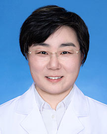

<!-- AUTO-GENERATED-BY: work/generate_obsidian_profiles.py -->

<!-- TEMPLATE: D:\workspace\信息收集整理\医生画像仓库\模板\医生画像模板.md -->

# 张晓娟

## 基础信息

| 字段 | 内容 |
|---|---|
| 姓名 | 张晓娟 |
| 医院 | 广东省人民医院 |
| 科室 | 药学部 |
| 职称/身份 | 主任药师 |
| 来源链接 | [官网原文](https://www.gdghospital.org.cn/Expertlistt/info_itemid_24036_subjectid_68.html) |
| 采集日期 | 2026-08-14 |

## 简介/擅长

血栓防治、心脑血管慢病管理、根据血药浓度或基因型检测结果制定个体化用药方案等工作

## 教育与进修经历

- 心血管、神经科、抗凝、血液临床药师 卫健委临床药师培训基地/师资培训基地带教老师 国家卫健委药具管理中心专家咨询信息管理系统专家库专家 广东省药学会药师处方审核能力培训师资 广东药科大学药学院客座教授 广州新华学院兼职教授 专业特长 ： 主要从事临床药学工作，擅长血栓防治、心脑血管慢病管理、根据血药浓度或基因型检测结果制定个体化用药方案等工作。

## 可包装亮点

- 心血管、神经科、抗凝、血液临床药师 卫健委临床药师培训基地/师资培训基地带教老师 国家卫健委药具管理中心专家咨询信息管理系统专家库专家 广东省药学会药师处方审核能力培训师资 广东药科大学药学院客座教授 广州新华学院兼职教授 专业特长 ： 主要从事临床药学工作，擅长血栓防治、心脑血管慢病管理、根据血药浓度或基因型检测结果制定个体化用药方案等工作。
- 学术兼职 ： 国际血管联盟（IUA）中国分部血管药物管理专家委员会委员 中国医药教育协会老年药学专业委员会委员 中国药理学会治疗药物监测研究专业委员会临床药师学组委员 广东省药学会免疫抑制药学专家委员会副主任委员 广东省药学会临床药学服务与实践专委会常务委员 广东省药学会血液科用药专家委员会常务委员 广东省药理学会药学监护专业委员会常务委员 广东省药理学会…

## 重点疾病/人群标签

- 慢性病：
- 肿瘤：
- 生殖疾病：
- 免疫/风湿：
- 术后恢复/康复：
- 疑难重症：

## 证据摘录

> 只摘录官网公开信息中的短句或关键字段，不复制大段原文。

- 官网身份字段：主任药师
- 官网简介/擅长：血栓防治、心脑血管慢病管理、根据血药浓度或基因型检测结果制定个体化用药方案等工作
- 官网亮眼经历线索：心血管、神经科、抗凝、血液临床药师 卫健委临床药师培训基地/师资培训基地带教老师 国家卫健委药具管理中心专家咨询信息管理系统专家库专家 广东省药学会药师处方审核能力培训师资 广东药科大学药学院客座教授 广州新华学院兼职教授 专业特长 ： 主要从事临床药学工作，擅长血栓防治、心脑血管慢病管理、根据血药浓度或基因型检测结果制定个体化用药方案等工作。 学术兼职 ： 国际血管联盟（IUA）中国分部血管药物管理专家委员会委员 中国医药教育协会老…
- 异常提示：职称/身份需人工复核
- 来源链接：https://www.gdghospital.org.cn/Expertlistt/info_itemid_24036_subjectid_68.html

## BD 画像摘要

张晓娟医生可作为广东省人民医院药学部的基础医生资料入库。当前重点方向以总底表标签为准，官网未展示的信息保持空白。

## 合规边界

- 仅使用医院官网、官方公众号、官方小程序等公开渠道。
- 不采集私人电话、私人微信、家庭住址、患者隐私或非公开排班信息。
- 不写“保证治愈”“疗效第一”“包治疑难杂症”等无法由官网证明的表述。
