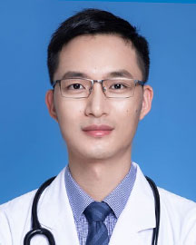

<!-- AUTO-GENERATED-BY: work/generate_obsidian_profiles.py -->

<!-- TEMPLATE: D:\workspace\信息收集整理\医生画像仓库\模板\医生画像模板.md -->

# 张泽锋

## 基础信息

| 字段 | 内容 |
|---|---|
| 姓名 | 张泽锋 |
| 医院 | 广东省人民医院 |
| 科室 | 消化内镜中心 |
| 职称/身份 | 主治医师 |
| 来源链接 | [官网原文](https://www.gdghospital.org.cn/Expertlistt/info_itemid_33921_subjectid_103.html) |
| 采集日期 | 2026-08-14 |

## 简介/擅长

消化内科及内镜常见病及多发病的诊治，对消化道早癌筛查、息肉切除、消化道早期肿瘤切除、消化道出血及狭窄、异物取出的内镜诊疗等有丰富的经验

## 科研项目与成果

- 目前主持广东省医学科研基金1项，第一作者发表SCI论文3篇、中华系列等核心期刊发表论文5篇。

## 论文与学术产出

- 目前主持广东省医学科研基金1项，第一作者发表SCI论文3篇、中华系列等核心期刊发表论文5篇。

## 可包装亮点

- 在读医学博士 担任内科教研室及消化内镜中心教学秘书，中华医学会消化内镜分会早癌协作组及结肠协作组委员，广东省医师协会消化医师分会青年委员及早癌学组青年委员，广东健康管理学会胃肠病学分会副秘书 从事消化内科临床及内镜诊疗工作近10年，熟悉消化内科及内镜常见病及多发病的诊治，对消化道早癌筛查、息肉切除、消化道早期肿瘤切除、消化道出血及狭窄、异物取出的内镜诊疗等…
- 目前主持广东省医学科研基金1项，第一作者发表SCI论文3篇、中华系列等核心期刊发表论文5篇。

## 重点疾病/人群标签

- 慢性病：
- 肿瘤：肿瘤、癌
- 生殖疾病：
- 免疫/风湿：
- 术后恢复/康复：
- 疑难重症：

## 证据摘录

> 只摘录官网公开信息中的短句或关键字段，不复制大段原文。

- 官网身份字段：主治医师
- 官网简介/擅长：消化内科及内镜常见病及多发病的诊治，对消化道早癌筛查、息肉切除、消化道早期肿瘤切除、消化道出血及狭窄、异物取出的内镜诊疗等有丰富的经验
- 官网亮眼经历线索：在读医学博士 担任内科教研室及消化内镜中心教学秘书，中华医学会消化内镜分会早癌协作组及结肠协作组委员，广东省医师协会消化医师分会青年委员及早癌学组青年委员，广东健康管理学会胃肠病学分会副秘书 从事消化内科临床及内镜诊疗工作近10年，熟悉消化内科及内镜常见病及多发病的诊治，对消化道早癌筛查、息肉切除、消化道早期肿瘤切除、消化道出血及狭窄、异物取出的内镜诊疗等有丰富的经验。 目前主持广东省医学科研基金1项，第一作者发表SCI论文3篇、中华…
- 来源链接：https://www.gdghospital.org.cn/Expertlistt/info_itemid_33921_subjectid_103.html

## BD 画像摘要

张泽锋医生可作为肿瘤方向的基础画像候选。后续 BD 使用应继续以官网来源和人工复核为准，不添加疗效承诺或无来源包装。

## 合规边界

- 仅使用医院官网、官方公众号、官方小程序等公开渠道。
- 不采集私人电话、私人微信、家庭住址、患者隐私或非公开排班信息。
- 不写“保证治愈”“疗效第一”“包治疑难杂症”等无法由官网证明的表述。
