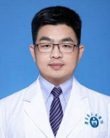

<!-- AUTO-GENERATED-BY: work/generate_obsidian_profiles.py -->

<!-- TEMPLATE: D:\workspace\信息收集整理\医生画像仓库\模板\医生画像模板.md -->

# 张登文

## 基础信息

| 字段 | 内容 |
|---|---|
| 姓名 | 张登文 |
| 医院 | 广东省人民医院 |
| 科室 | 麻醉科 |
| 职称/身份 | 副主任医师 |
| 来源链接 | [官网原文](https://www.gdghospital.org.cn/Expertlistt/info_itemid_45126_subjectid_13.html) |
| 采集日期 | 2026-08-14 |

## 简介/擅长

超声引导神经阻滞、急慢性疼痛管理、分娩镇痛、器官移植麻醉、困难气道的处理

## 教育与进修经历

- 简介 ：博士研究生，本硕博毕业于华中科技大学同济医学院，从事围术期器官（心、脑）保护及疼痛机制的研究。
- 于2018-2019年在香港大学李嘉诚医学院做访问学者。

## 科研项目与成果

- 主持国家自然科学基金青年基金1项，广东省级课题项目2项，并参与了多项国家及省级课题的研究。

## 论文与学术产出

- 在国内外权威期刊发表相关学术论文30余篇，其中SCI收录10余篇。

## 可包装亮点

- 于2018-2019年在香港大学李嘉诚医学院做访问学者。
- 中国心胸血管麻醉学会非心脏手术麻醉分会第二届青年委员会副主任委员，广东省医学会麻醉学分会青年委员，广东省医师协会麻醉医师分会青年学组委员。
- 主持国家自然科学基金青年基金1项，广东省级课题项目2项，并参与了多项国家及省级课题的研究。
- 在国内外权威期刊发表相关学术论文30余篇，其中SCI收录10余篇。

## 重点疾病/人群标签

- 慢性病：慢性、疼痛
- 肿瘤：
- 生殖疾病：
- 免疫/风湿：
- 术后恢复/康复：慢性、疼痛
- 疑难重症：

## 证据摘录

> 只摘录官网公开信息中的短句或关键字段，不复制大段原文。

- 官网身份字段：副主任医师
- 官网简介/擅长：超声引导神经阻滞、急慢性疼痛管理、分娩镇痛、器官移植麻醉、困难气道的处理
- 官网亮眼经历线索：于2018-2019年在香港大学李嘉诚医学院做访问学者。 中国心胸血管麻醉学会非心脏手术麻醉分会第二届青年委员会副主任委员，广东省医学会麻醉学分会青年委员，广东省医师协会麻醉医师分会青年学组委员。 主持国家自然科学基金青年基金1项，广东省级课题项目2项，并参与了多项国家及省级课题的研究。 在国内外权威期刊发表相关学术论文30余篇，其中SCI收录10余篇。
- 来源链接：https://www.gdghospital.org.cn/Expertlistt/info_itemid_45126_subjectid_13.html

## BD 画像摘要

张登文医生可作为慢性病、术后恢复/康复方向的基础画像候选。后续 BD 使用应继续以官网来源和人工复核为准，不添加疗效承诺或无来源包装。

## 合规边界

- 仅使用医院官网、官方公众号、官方小程序等公开渠道。
- 不采集私人电话、私人微信、家庭住址、患者隐私或非公开排班信息。
- 不写“保证治愈”“疗效第一”“包治疑难杂症”等无法由官网证明的表述。
