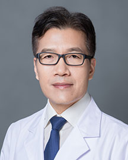

<!-- AUTO-GENERATED-BY: work/generate_obsidian_profiles.py -->

<!-- TEMPLATE: D:\workspace\信息收集整理\医生画像仓库\模板\医生画像模板.md -->

# 张良

## 基础信息

| 字段 | 内容 |
|---|---|
| 姓名 | 张良 |
| 医院 | 广东省人民医院 |
| 科室 | 眼科 |
| 职称/身份 | 主任医师 |
| 来源链接 | [官网原文](https://www.gdghospital.org.cn/Expertlistt/info_itemid_24982_subjectid_46.html) |
| 采集日期 | 2026-08-14 |

## 简介/擅长

眼底疾病、白内障、青光眼等疾病的诊断和治疗，白内障手术、复杂性视网膜脱离及糖尿病视网膜病变手术达国内外先进水平

## 科研项目与成果

- 主持或作为主要研究人完成及在研国家和省级科研项目12项，发表学术论文四十余篇。
- 科研项目“现代玻璃体手术的推广应用”曾获卫生部科技进步三等奖。

## 论文与学术产出

- 主持或作为主要研究人完成及在研国家和省级科研项目12项，发表学术论文四十余篇。

## 可包装亮点

- 医学博士，南方医科大学及汕头大学硕士生导师，广东省眼病防治研究所副所长 全国防盲技术指导组委员、广东省医学会眼科学分会委员、广东省医师协会眼科分会副主任委员、广东省眼科质量控制中心副组长、广东省防盲专业指导组副组长、广东省眼健康专业管理委员会副主任委员、广东省中老年眼保健专业委员会主任委员、广东省眼底病影像专业委员会副主任委员、广东省视力残疾康复专业委员会…
- 主持或作为主要研究人完成及在研国家和省级科研项目12项，发表学术论文四十余篇。
- 科研项目“现代玻璃体手术的推广应用”曾获卫生部科技进步三等奖。

## 重点疾病/人群标签

- 慢性病：糖尿病、康复、复杂
- 肿瘤：
- 生殖疾病：
- 免疫/风湿：
- 术后恢复/康复：糖尿病、康复、复杂
- 疑难重症：糖尿病、康复、复杂

## 证据摘录

> 只摘录官网公开信息中的短句或关键字段，不复制大段原文。

- 官网身份字段：主任医师
- 官网简介/擅长：眼底疾病、白内障、青光眼等疾病的诊断和治疗，白内障手术、复杂性视网膜脱离及糖尿病视网膜病变手术达国内外先进水平
- 官网亮眼经历线索：医学博士，南方医科大学及汕头大学硕士生导师，广东省眼病防治研究所副所长 全国防盲技术指导组委员、广东省医学会眼科学分会委员、广东省医师协会眼科分会副主任委员、广东省眼科质量控制中心副组长、广东省防盲专业指导组副组长、广东省眼健康专业管理委员会副主任委员、广东省中老年眼保健专业委员会主任委员、广东省眼底病影像专业委员会副主任委员、广东省视力残疾康复专业委员会副主任委员、广东省残疾人康复协会理事、广东省视光学会理事、广东省医疗行业协会眼科…
- 来源链接：https://www.gdghospital.org.cn/Expertlistt/info_itemid_24982_subjectid_46.html

## BD 画像摘要

张良医生可作为慢性病、术后恢复/康复、疑难重症方向的基础画像候选。后续 BD 使用应继续以官网来源和人工复核为准，不添加疗效承诺或无来源包装。

## 合规边界

- 仅使用医院官网、官方公众号、官方小程序等公开渠道。
- 不采集私人电话、私人微信、家庭住址、患者隐私或非公开排班信息。
- 不写“保证治愈”“疗效第一”“包治疑难杂症”等无法由官网证明的表述。
