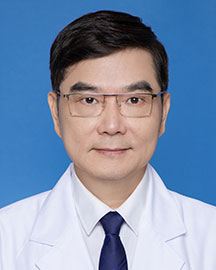

<!-- AUTO-GENERATED-BY: work/generate_obsidian_profiles.py -->

<!-- TEMPLATE: D:\workspace\信息收集整理\医生画像仓库\模板\医生画像模板.md -->

# 张鸣生

## 基础信息

| 字段 | 内容 |
|---|---|
| 姓名 | 张鸣生 |
| 医院 | 广东省人民医院 |
| 科室 | 康复医学科 |
| 职称/身份 | 主任医师 资深主任 |
| 来源链接 | [官网原文](https://www.gdghospital.org.cn/Expertlistt/info_itemid_23066_subjectid_97.html) |
| 采集日期 | 2026-08-14 |

## 简介/擅长

## 科研项目与成果

- 先后完成和主持国家、省、市各级课题多项，发表40余篇高水平论文，其中SCI论文10余篇，主编和参编医学专著3部。

## 论文与学术产出

- 先后完成和主持国家、省、市各级课题多项，发表40余篇高水平论文，其中SCI论文10余篇，主编和参编医学专著3部。

## 可包装亮点

- 医学博士、教授、博士研究生导师、国家科学技术奖评审专家 从事康复医学工作30余年，具有丰富的临床康复诊疗经验。
- 先后完成和主持国家、省、市各级课题多项，发表40余篇高水平论文，其中SCI论文10余篇，主编和参编医学专著3部。
- 任中华医学会物理医学与康复学分会全国委员，中华医学会老年医学分会老年康复学组组长，中国医院协会康复医学管理专业委员会副主任委员，广东省医学会物理医学与康复学分会第十一届委员会前任主任委员，广东省医院协会康复医学管理专业委员会第二届主任委员，广东省康复医学发展研究会会长，广东省医师协会康复医师分会副主任委员，国际物理与康复医学会（ISPRM）国家学会会员，中…

## 重点疾病/人群标签

- 慢性病：
- 肿瘤：
- 生殖疾病：
- 免疫/风湿：
- 术后恢复/康复：康复
- 疑难重症：

## 证据摘录

> 只摘录官网公开信息中的短句或关键字段，不复制大段原文。

- 官网身份字段：主任医师 资深主任
- 官网亮眼经历线索：医学博士、教授、博士研究生导师、国家科学技术奖评审专家 从事康复医学工作30余年，具有丰富的临床康复诊疗经验。 先后完成和主持国家、省、市各级课题多项，发表40余篇高水平论文，其中SCI论文10余篇，主编和参编医学专著3部。 任中华医学会物理医学与康复学分会全国委员，中华医学会老年医学分会老年康复学组组长，中国医院协会康复医学管理专业委员会副主任委员，广东省医学会物理医学与康复学分会第十一届委员会前任主任委员，广东省医院协会康复医学管…
- 来源链接：https://www.gdghospital.org.cn/Expertlistt/info_itemid_23066_subjectid_97.html

## BD 画像摘要

张鸣生医生可作为术后恢复/康复方向的基础画像候选。后续 BD 使用应继续以官网来源和人工复核为准，不添加疗效承诺或无来源包装。

## 合规边界

- 仅使用医院官网、官方公众号、官方小程序等公开渠道。
- 不采集私人电话、私人微信、家庭住址、患者隐私或非公开排班信息。
- 不写“保证治愈”“疗效第一”“包治疑难杂症”等无法由官网证明的表述。
