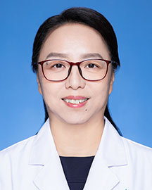

<!-- AUTO-GENERATED-BY: work/generate_obsidian_profiles.py -->

<!-- TEMPLATE: D:\workspace\信息收集整理\医生画像仓库\模板\医生画像模板.md -->

# 徐丽姝

## 基础信息

| 字段 | 内容 |
|---|---|
| 姓名 | 徐丽姝 |
| 医院 | 广东省人民医院 |
| 科室 | 全科医学科 |
| 职称/身份 | 主任医师 |
| 来源链接 | [官网原文](https://www.gdghospital.org.cn/Expertlistt/info_itemid_25105_subjectid_90.html) |
| 采集日期 | 2026-08-14 |

## 简介/擅长

脂肪肝和消化道肿瘤的早期诊治

## 教育与进修经历

- 老年消化科主任、硕士研究生导师 • 中华医学会老年分会消化学组 委员 • 广东省医院协会老年专委会 主委 • 广东省医学会肝病分会 副主委 • 广东省医疗行业协会消化系统疾病规范化管理分会 主委 • 广东省健康管理分会脂肪肝多学科诊治专业委员会 副主委 • 广东省营养学会老年营养分会 副主委 1993年毕业于中国医科大学，2008年获中山大学医学硕士学位，一直从事老年病人消化系统疾病的临床工作，承担并参与省级科研项目多项。

## 科研项目与成果

- 老年消化科主任、硕士研究生导师 • 中华医学会老年分会消化学组 委员 • 广东省医院协会老年专委会 主委 • 广东省医学会肝病分会 副主委 • 广东省医疗行业协会消化系统疾病规范化管理分会 主委 • 广东省健康管理分会脂肪肝多学科诊治专业委员会 副主委 • 广东省营养学会老年营养分会 副主委 1993年毕业于中国医科大学，2008年获中山大学医学硕士学位，一直从事老年病人消化系统疾病的临床工作，承担并参与省级科研项目多项。

## 论文与学术产出

- 在国内外医学核心期刊发表论文20多篇，参与编写学术著作多部。

## 可包装亮点

- 老年消化科主任、硕士研究生导师 • 中华医学会老年分会消化学组 委员 • 广东省医院协会老年专委会 主委 • 广东省医学会肝病分会 副主委 • 广东省医疗行业协会消化系统疾病规范化管理分会 主委 • 广东省健康管理分会脂肪肝多学科诊治专业委员会 副主委 • 广东省营养学会老年营养分会 副主委 1993年毕业于中国医科大学，2008年获中山大学医学硕士学位…
- 在国内外医学核心期刊发表论文20多篇，参与编写学术著作多部。

## 重点疾病/人群标签

- 慢性病：慢性、肿瘤、营养、多学科
- 肿瘤：慢性、肿瘤、营养、多学科
- 生殖疾病：
- 免疫/风湿：
- 术后恢复/康复：慢性、肿瘤、营养、多学科
- 疑难重症：慢性、肿瘤、营养、多学科

## 证据摘录

> 只摘录官网公开信息中的短句或关键字段，不复制大段原文。

- 官网身份字段：主任医师
- 官网简介/擅长：脂肪肝和消化道肿瘤的早期诊治
- 官网亮眼经历线索：老年消化科主任、硕士研究生导师 • 中华医学会老年分会消化学组 委员 • 广东省医院协会老年专委会 主委 • 广东省医学会肝病分会 副主委 • 广东省医疗行业协会消化系统疾病规范化管理分会 主委 • 广东省健康管理分会脂肪肝多学科诊治专业委员会 副主委 • 广东省营养学会老年营养分会 副主委 1993年毕业于中国医科大学，2008年获中山大学医学硕士学位，一直从事老年病人消化系统疾病的临床工作，承担并参与省级科研项目多项。 在国内外医…
- 来源链接：https://www.gdghospital.org.cn/Expertlistt/info_itemid_25105_subjectid_90.html

## BD 画像摘要

徐丽姝医生可作为慢性病、肿瘤、术后恢复/康复、疑难重症方向的基础画像候选。后续 BD 使用应继续以官网来源和人工复核为准，不添加疗效承诺或无来源包装。

## 合规边界

- 仅使用医院官网、官方公众号、官方小程序等公开渠道。
- 不采集私人电话、私人微信、家庭住址、患者隐私或非公开排班信息。
- 不写“保证治愈”“疗效第一”“包治疑难杂症”等无法由官网证明的表述。
