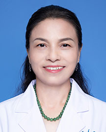

<!-- AUTO-GENERATED-BY: work/generate_obsidian_profiles.py -->

<!-- TEMPLATE: D:\workspace\信息收集整理\医生画像仓库\模板\医生画像模板.md -->

# 徐书雯

## 基础信息

| 字段 | 内容 |
|---|---|
| 姓名 | 徐书雯 |
| 医院 | 广东省人民医院 |
| 科室 | 老年神经科 |
| 职称/身份 | 主任医师 |
| 来源链接 | [官网原文](https://www.gdghospital.org.cn/Expertlistt/info_itemid_25118_subjectid_91.html) |
| 采集日期 | 2026-08-14 |

## 简介/擅长

擅长记忆和认知障碍、脑血管病、帕金森病、头痛头晕、睡眠障碍等诊治，尤在阿尔茨海默病诊治及研究上有较高造诣

## 可包装亮点

- 简介 ：主任医师，南方医科大学硕士导师/教授，汕头医科大学硕士导师，从医三十八年；
- 曾在德国美国学习。
- 广东省人民医院/广东省老年医学研究所/老年神经科科主任 社会任职 ：广东省医学会神经病学分会副主任委员/原痴呆学组组长，广东省老年保健协会神经内科副主任委员、广东省医学会老年医学分会老年认知精神障碍学组组长、广东省健康管理学会干细胞和再生医学专业委员会常委、广东省干部医疗保健专家组成员。

## 重点疾病/人群标签

- 慢性病：
- 肿瘤：
- 生殖疾病：
- 免疫/风湿：
- 术后恢复/康复：
- 疑难重症：

## 证据摘录

> 只摘录官网公开信息中的短句或关键字段，不复制大段原文。

- 官网身份字段：主任医师
- 官网简介/擅长：擅长记忆和认知障碍、脑血管病、帕金森病、头痛头晕、睡眠障碍等诊治，尤在阿尔茨海默病诊治及研究上有较高造诣
- 官网亮眼经历线索：简介 ：主任医师，南方医科大学硕士导师/教授，汕头医科大学硕士导师，从医三十八年； 曾在德国美国学习。 广东省人民医院/广东省老年医学研究所/老年神经科科主任 社会任职 ：广东省医学会神经病学分会副主任委员/原痴呆学组组长，广东省老年保健协会神经内科副主任委员、广东省医学会老年医学分会老年认知精神障碍学组组长、广东省健康管理学会干细胞和再生医学专业委员会常委、广东省干部医疗保健专家组成员。
- 来源链接：https://www.gdghospital.org.cn/Expertlistt/info_itemid_25118_subjectid_91.html

## BD 画像摘要

徐书雯医生可作为广东省人民医院老年神经科的基础医生资料入库。当前重点方向以总底表标签为准，官网未展示的信息保持空白。

## 合规边界

- 仅使用医院官网、官方公众号、官方小程序等公开渠道。
- 不采集私人电话、私人微信、家庭住址、患者隐私或非公开排班信息。
- 不写“保证治愈”“疗效第一”“包治疑难杂症”等无法由官网证明的表述。
