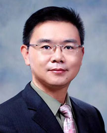

<!-- AUTO-GENERATED-BY: work/generate_obsidian_profiles.py -->

<!-- TEMPLATE: D:\workspace\信息收集整理\医生画像仓库\模板\医生画像模板.md -->

# 徐光青

## 基础信息

| 字段 | 内容 |
|---|---|
| 姓名 | 徐光青 |
| 医院 | 广东省人民医院 |
| 科室 | 康复医学科 |
| 职称/身份 | 主任医师 科主任 |
| 来源链接 | [官网原文](https://www.gdghospital.org.cn/Expertlistt/info_itemid_23080_subjectid_97.html) |
| 采集日期 | 2026-08-14 |

## 简介/擅长

脑血管病、脑心同康同治、脑部疾病术后、脊髓损伤、周围神经病、头晕、急慢性疼痛和认知障碍的临床与康复治疗

## 教育与进修经历

- 博士生导师，博士后合作导师。

## 科研项目与成果

- 社会任职 ： 中国康复医学会老年痴呆与认知障碍康复专业委员会 副主任委员 中国康复医学会智能康复专业委员会 副主任委员 中国医院协会医疗康复机构委员会 常委 中国技术市场协会医械专委会专家组专家 广东省干细胞与再生医学协会康复专委会 主任委员 广东省医学会物理医学与康复分会 副主任委员 广东省医师协会康复科医师分会 副主任委员 广东省医院协会康复管理专委会 副主任委员 《Frontiers in Neuroscience》杂志客座主编 《中华物理医学与康复杂志》编委 学术成果 ： 主要从事脑调控与脑可塑性研究，致…
- 2018年入选首都医科大学高层次人才项目。
- 作为负责人主持国家自然科学基金面上项目5项、国家重点研发计划分题1项和其他省部级重点项目2项等。
- 申请并获授权发明专利2项和实用新型专利3项。

## 论文与学术产出

- 社会任职 ： 中国康复医学会老年痴呆与认知障碍康复专业委员会 副主任委员 中国康复医学会智能康复专业委员会 副主任委员 中国医院协会医疗康复机构委员会 常委 中国技术市场协会医械专委会专家组专家 广东省干细胞与再生医学协会康复专委会 主任委员 广东省医学会物理医学与康复分会 副主任委员 广东省医师协会康复科医师分会 副主任委员 广东省医院协会康复管理专委会 副主任委员 《Frontiers in Neuroscience》杂志客座主编 《中华物理医学与康复杂志》编委 学术成果 ： 主要从事脑调控与脑可塑性研究，致…
- 发表研究论文近100篇，其中SCI收录50余篇，包括Cell、Cell Death & Disease、Brain Stimulation、NeuroImage等杂志，总影响因子近300分。
- 主译学术专著《神经发育疗法临床实践指南》、主编学术专著《老年退行性疾病康复》等。

## 可包装亮点

- 教授／主任医师；
- 博士生导师，博士后合作导师。
- 作为北京天坛医院康复医学科（神经康复中心）的创建人，成立了北京市第一个康复医学知名专家团队：徐光青教授脑修复与脑康复知名专家团队，并与英国伦敦大学学院开展了联合研究等工作。
- 社会任职 ： 中国康复医学会老年痴呆与认知障碍康复专业委员会 副主任委员 中国康复医学会智能康复专业委员会 副主任委员 中国医院协会医疗康复机构委员会 常委 中国技术市场协会医械专委会专家组专家 广东省干细胞与再生医学协会康复专委会 主任委员 广东省医学会物理医学与康复分会 副主任委员 广东省医师协会康复科医师分会 副主任委员 广东省医院协会康复管理专委会…

## 重点疾病/人群标签

- 慢性病：慢性、术后、康复、疼痛、复杂
- 肿瘤：
- 生殖疾病：
- 免疫/风湿：
- 术后恢复/康复：慢性、术后、康复、疼痛、复杂
- 疑难重症：慢性、术后、康复、疼痛、复杂

## 证据摘录

> 只摘录官网公开信息中的短句或关键字段，不复制大段原文。

- 官网身份字段：主任医师 科主任
- 官网简介/擅长：脑血管病、脑心同康同治、脑部疾病术后、脊髓损伤、周围神经病、头晕、急慢性疼痛和认知障碍的临床与康复治疗
- 官网亮眼经历线索：教授／主任医师； 博士生导师，博士后合作导师。 作为北京天坛医院康复医学科（神经康复中心）的创建人，成立了北京市第一个康复医学知名专家团队：徐光青教授脑修复与脑康复知名专家团队，并与英国伦敦大学学院开展了联合研究等工作。 社会任职 ： 中国康复医学会老年痴呆与认知障碍康复专业委员会 副主任委员 中国康复医学会智能康复专业委员会 副主任委员 中国医院协会医疗康复机构委员会 常委 中国技术市场协会医械专委会专家组专家 广东省干细胞与再生医…
- 来源链接：https://www.gdghospital.org.cn/Expertlistt/info_itemid_23080_subjectid_97.html

## BD 画像摘要

徐光青医生可作为慢性病、术后恢复/康复、疑难重症方向的基础画像候选。后续 BD 使用应继续以官网来源和人工复核为准，不添加疗效承诺或无来源包装。

## 合规边界

- 仅使用医院官网、官方公众号、官方小程序等公开渠道。
- 不采集私人电话、私人微信、家庭住址、患者隐私或非公开排班信息。
- 不写“保证治愈”“疗效第一”“包治疑难杂症”等无法由官网证明的表述。
