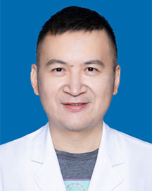

<!-- AUTO-GENERATED-BY: work/generate_obsidian_profiles.py -->

<!-- TEMPLATE: D:\workspace\信息收集整理\医生画像仓库\模板\医生画像模板.md -->

# 徐崇锐

## 基础信息

| 字段 | 内容 |
|---|---|
| 姓名 | 徐崇锐 |
| 医院 | 广东省人民医院 |
| 科室 | 肺内二科 |
| 职称/身份 | 副主任医师 |
| 来源链接 | [官网原文](https://www.gdghospital.org.cn/Expertlistt/info_itemid_25043_subjectid_26.html) |
| 采集日期 | 2026-08-14 |

## 简介/擅长

肺癌的多学科综合治疗，尤其是对免疫治疗有深入研究

## 教育与进修经历

- 医学博士，副主任医师 师从于我国著名胸部肿瘤学专家吴一龙教授，2006 年获得中山大学肿瘤学博士学位，2018 年大美国 Memorial Sloan Kettering Cancer Center 学习。

## 科研项目与成果

- 擅长运用国际最新诊治规范以及最新基础研究、转化性研究成果，为患者提供最前沿的诊治信息，合理运用多学科治疗手段、结合患者基因表达特征分析对肺癌患者进行量体裁衣式的个体化治疗，严谨、精益求精的工作态度受到广泛好评。
- 参加国际国内大型、多中心临床研究 60 余项，参加包括国家 863 项目在内的多项国家级、省级科研课题的研究工作。

## 论文与学术产出

- 发表 SCI 论文 10 余篇。

## 可包装亮点

- 医学博士，副主任医师 师从于我国著名胸部肿瘤学专家吴一龙教授，2006 年获得中山大学肿瘤学博士学位，2018 年大美国 Memorial Sloan Kettering Cancer Center 学习。
- 主攻肺癌的多学科综合治疗，尤其是对免疫治疗有深入研究。
- 擅长运用国际最新诊治规范以及最新基础研究、转化性研究成果，为患者提供最前沿的诊治信息，合理运用多学科治疗手段、结合患者基因表达特征分析对肺癌患者进行量体裁衣式的个体化治疗，严谨、精益求精的工作态度受到广泛好评。
- 发表 SCI 论文 10 余篇。

## 重点疾病/人群标签

- 慢性病：
- 肿瘤：肿瘤、肺癌、免疫、多学科
- 生殖疾病：
- 免疫/风湿：肿瘤、肺癌、免疫、多学科
- 术后恢复/康复：
- 疑难重症：肿瘤、肺癌、免疫、多学科

## 证据摘录

> 只摘录官网公开信息中的短句或关键字段，不复制大段原文。

- 官网身份字段：副主任医师
- 官网简介/擅长：肺癌的多学科综合治疗，尤其是对免疫治疗有深入研究
- 官网亮眼经历线索：医学博士，副主任医师 师从于我国著名胸部肿瘤学专家吴一龙教授，2006 年获得中山大学肿瘤学博士学位，2018 年大美国 Memorial Sloan Kettering Cancer Center 学习。 主攻肺癌的多学科综合治疗，尤其是对免疫治疗有深入研究。 擅长运用国际最新诊治规范以及最新基础研究、转化性研究成果，为患者提供最前沿的诊治信息，合理运用多学科治疗手段、结合患者基因表达特征分析对肺癌患者进行量体裁衣式的个体化治疗，严…
- 来源链接：https://www.gdghospital.org.cn/Expertlistt/info_itemid_25043_subjectid_26.html

## BD 画像摘要

徐崇锐医生可作为肿瘤、免疫/风湿/感染、疑难重症方向的基础画像候选。后续 BD 使用应继续以官网来源和人工复核为准，不添加疗效承诺或无来源包装。

## 合规边界

- 仅使用医院官网、官方公众号、官方小程序等公开渠道。
- 不采集私人电话、私人微信、家庭住址、患者隐私或非公开排班信息。
- 不写“保证治愈”“疗效第一”“包治疑难杂症”等无法由官网证明的表述。
