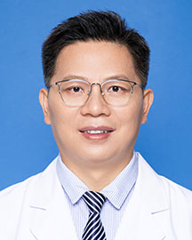

<!-- AUTO-GENERATED-BY: work/generate_obsidian_profiles.py -->

<!-- TEMPLATE: D:\workspace\信息收集整理\医生画像仓库\模板\医生画像模板.md -->

# 徐方平

## 基础信息

| 字段 | 内容 |
|---|---|
| 姓名 | 徐方平 |
| 医院 | 广东省人民医院 |
| 科室 | 病理科 |
| 职称/身份 | 主任医师 |
| 来源链接 | [官网原文](https://www.gdghospital.org.cn/Expertlistt/info_itemid_25296_subjectid_59.html) |
| 采集日期 | 2026-08-14 |

## 简介/擅长

## 科研项目与成果

- 博士，分子病理实验室负责人，乳腺、泌尿及骨病理亚专科带头人 国家卫健委病理质控中心（PQCC）南区乳腺癌HER2判读专家，参与乳腺癌雌、孕激素受体免疫组化检测指南、乳腺癌HER2检测及判断指南、乳腺癌新辅助治疗后反应病理评价专家共识、 乳腺导管原位癌病理诊断指南、中国心血管疾病临床病理标本处理与检测规范等指南与共识的编写 中国抗癌协会乳腺癌整合防筛专业委员会委员，中华医学会病理学分会乳腺学组委员(第1-3届），中国抗癌协会肿瘤病理专业委员会乳腺学组、食管学组委员，广东省医学会精准医学及分子诊断学会常委，广东省医师…
- 科研：主持国家自然科学基金（青年基金）1项，参与1项国家自然科学基金（排名第2），广州市科技计划项目1项，广东省医学科学基金1项；

## 论文与学术产出

- 以第一（并列第一）及通讯作者发表SCI论文十余篇，总影响子80余分，单篇最高影响因子12.56分；

## 可包装亮点

- 博士，分子病理实验室负责人，乳腺、泌尿及骨病理亚专科带头人 国家卫健委病理质控中心（PQCC）南区乳腺癌HER2判读专家，参与乳腺癌雌、孕激素受体免疫组化检测指南、乳腺癌HER2检测及判断指南、乳腺癌新辅助治疗后反应病理评价专家共识、 乳腺导管原位癌病理诊断指南、中国心血管疾病临床病理标本处理与检测规范等指南与共识的编写 中国抗癌协会乳腺癌整合防筛专业委员…

## 重点疾病/人群标签

- 慢性病：
- 肿瘤：肿瘤、癌、靶向、乳腺癌、免疫
- 生殖疾病：
- 免疫/风湿：肿瘤、癌、靶向、乳腺癌、免疫
- 术后恢复/康复：
- 疑难重症：

## 证据摘录

> 只摘录官网公开信息中的短句或关键字段，不复制大段原文。

- 官网身份字段：主任医师
- 官网亮眼经历线索：博士，分子病理实验室负责人，乳腺、泌尿及骨病理亚专科带头人 国家卫健委病理质控中心（PQCC）南区乳腺癌HER2判读专家，参与乳腺癌雌、孕激素受体免疫组化检测指南、乳腺癌HER2检测及判断指南、乳腺癌新辅助治疗后反应病理评价专家共识、 乳腺导管原位癌病理诊断指南、中国心血管疾病临床病理标本处理与检测规范等指南与共识的编写 中国抗癌协会乳腺癌整合防筛专业委员会委员，中华医学会病理学分会乳腺学组委员(第1-3届），中国抗癌协会肿瘤病理专业…
- 来源链接：https://www.gdghospital.org.cn/Expertlistt/info_itemid_25296_subjectid_59.html

## BD 画像摘要

徐方平医生可作为肿瘤、免疫/风湿/感染方向的基础画像候选。后续 BD 使用应继续以官网来源和人工复核为准，不添加疗效承诺或无来源包装。

## 合规边界

- 仅使用医院官网、官方公众号、官方小程序等公开渠道。
- 不采集私人电话、私人微信、家庭住址、患者隐私或非公开排班信息。
- 不写“保证治愈”“疗效第一”“包治疑难杂症”等无法由官网证明的表述。
