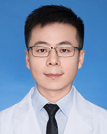

<!-- AUTO-GENERATED-BY: work/generate_obsidian_profiles.py -->

<!-- TEMPLATE: D:\workspace\信息收集整理\医生画像仓库\模板\医生画像模板.md -->

# 曹希明

## 基础信息

| 字段 | 内容 |
|---|---|
| 姓名 | 曹希明 |
| 医院 | 广东省人民医院 |
| 科室 | 放射科 |
| 职称/身份 | 副主任技师 |
| 来源链接 | [官网原文](https://www.gdghospital.org.cn/Expertlistt/info_itemid_33705_subjectid_64.html) |
| 采集日期 | 2026-08-14 |

## 简介/擅长

擅长心血管CT成像技术

## 教育与进修经历

- 毕业于四川大学医学影像技术专业，从事影像技术工作18年。

## 科研项目与成果

- 以第一作者及合作作者发表论文多篇，主持省级课题一项，参与多项国家和省级课题；

## 论文与学术产出

- 以第一作者及合作作者发表论文多篇，主持省级课题一项，参与多项国家和省级课题；

## 可包装亮点

- 以第一作者及合作作者发表论文多篇，主持省级课题一项，参与多项国家和省级课题；
- 中华医学会影像技术分会委员，广东省医学会影像技术学分会委员，广东省医学会影像技术学分会工程教育护理学组组长，中国医师协会医学技师专委会青委委员。

## 重点疾病/人群标签

- 慢性病：
- 肿瘤：
- 生殖疾病：
- 免疫/风湿：
- 术后恢复/康复：
- 疑难重症：

## 证据摘录

> 只摘录官网公开信息中的短句或关键字段，不复制大段原文。

- 官网身份字段：副主任技师
- 官网简介/擅长：擅长心血管CT成像技术
- 官网亮眼经历线索：以第一作者及合作作者发表论文多篇，主持省级课题一项，参与多项国家和省级课题； 中华医学会影像技术分会委员，广东省医学会影像技术学分会委员，广东省医学会影像技术学分会工程教育护理学组组长，中国医师协会医学技师专委会青委委员。
- 来源链接：https://www.gdghospital.org.cn/Expertlistt/info_itemid_33705_subjectid_64.html

## BD 画像摘要

曹希明医生可作为广东省人民医院放射科的基础医生资料入库。当前重点方向以总底表标签为准，官网未展示的信息保持空白。

## 合规边界

- 仅使用医院官网、官方公众号、官方小程序等公开渠道。
- 不采集私人电话、私人微信、家庭住址、患者隐私或非公开排班信息。
- 不写“保证治愈”“疗效第一”“包治疑难杂症”等无法由官网证明的表述。
