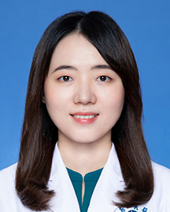

<!-- AUTO-GENERATED-BY: work/generate_obsidian_profiles.py -->

<!-- TEMPLATE: D:\workspace\信息收集整理\医生画像仓库\模板\医生画像模板.md -->

# 曹莉

## 基础信息

| 字段 | 内容 |
|---|---|
| 姓名 | 曹莉 |
| 医院 | 广东省人民医院 |
| 科室 | 乳腺科 |
| 职称/身份 | 主治医师 |
| 来源链接 | [官网原文](https://www.gdghospital.org.cn/Expertlistt/info_itemid_32871_subjectid_29.html) |
| 采集日期 | 2026-08-14 |

## 简介/擅长

## 教育与进修经历

- 2008-2016年就读于南方医科大学临床医学专业，获得医学博士学位。
- 攻读博士学位期间曾以第一作者身份国内外杂志发表文章多篇。

## 论文与学术产出

- 攻读博士学位期间曾以第一作者身份国内外杂志发表文章多篇。

## 可包装亮点

- 中共党员 广东省人民医院外科乳腺科 医师 临床医学(外科学)博士 广东省药学会乳腺癌专业委员会秘书 广东省女医师协会乳腺癌专业委员会委员 广东省基层医药学会乳腺癌专业委员会委员 广东省分子生物协会(GACA)委员 广州市医学会乳腺病学分会青年委员会委员 2019年赴美国凤凰城乳腺与肠道外科辅助治疗研究组（The National Surgical Adju…
- 攻读博士学位期间曾以第一作者身份国内外杂志发表文章多篇。
- 主要致力于乳腺癌转化医学研究，并在廖宁教授指导下学习并掌握包括乳腺癌手术治疗、化疗、内分泌治疗及分子靶向治疗等多学科综合治疗。

## 重点疾病/人群标签

- 慢性病：
- 肿瘤：化疗、靶向、乳腺癌、多学科
- 生殖疾病：
- 免疫/风湿：
- 术后恢复/康复：
- 疑难重症：化疗、靶向、乳腺癌、多学科

## 证据摘录

> 只摘录官网公开信息中的短句或关键字段，不复制大段原文。

- 官网身份字段：主治医师
- 官网亮眼经历线索：中共党员 广东省人民医院外科乳腺科 医师 临床医学(外科学)博士 广东省药学会乳腺癌专业委员会秘书 广东省女医师协会乳腺癌专业委员会委员 广东省基层医药学会乳腺癌专业委员会委员 广东省分子生物协会(GACA)委员 广州市医学会乳腺病学分会青年委员会委员 2019年赴美国凤凰城乳腺与肠道外科辅助治疗研究组（The National Surgical Adjuvant Breast and Bowel Project, NSABP）学习…
- 来源链接：https://www.gdghospital.org.cn/Expertlistt/info_itemid_32871_subjectid_29.html

## BD 画像摘要

曹莉医生可作为肿瘤、疑难重症方向的基础画像候选。后续 BD 使用应继续以官网来源和人工复核为准，不添加疗效承诺或无来源包装。

## 合规边界

- 仅使用医院官网、官方公众号、官方小程序等公开渠道。
- 不采集私人电话、私人微信、家庭住址、患者隐私或非公开排班信息。
- 不写“保证治愈”“疗效第一”“包治疑难杂症”等无法由官网证明的表述。
