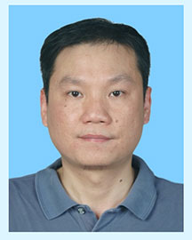

<!-- AUTO-GENERATED-BY: work/generate_obsidian_profiles.py -->

<!-- TEMPLATE: D:\workspace\信息收集整理\医生画像仓库\模板\医生画像模板.md -->

# 曾少建

## 基础信息

| 字段 | 内容 |
|---|---|
| 姓名 | 曾少建 |
| 医院 | 广东省人民医院 |
| 科室 | 神经外科 |
| 职称/身份 | 主任医师 |
| 来源链接 | [官网原文](https://www.gdghospital.org.cn/Expertlistt/info_itemid_24768_subjectid_11.html) |
| 采集日期 | 2026-08-14 |

## 简介/擅长

熟悉神经外科常见病、多发病的诊治

## 科研项目与成果

- 科研： 主持和参与省部级及厅局科研课题6项；

## 论文与学术产出

- 撰写中文核心期刊20多篇

## 可包装亮点

- 中共党员，本科（中山大学医学院六年制） 社会兼职： 广东省劳动能力鉴定委员会专家组委员 学历及工作经历： 1987年7月至1993年6月在中山医科大学临床医学系就读本科六年制。
- 2005年12月至2010年11月在广东省人民医院神经外科任副主任医师。
- 2010年12月至今在广东省人民医院神经外科任主任医师。

## 重点疾病/人群标签

- 慢性病：
- 肿瘤：瘤
- 生殖疾病：
- 免疫/风湿：
- 术后恢复/康复：
- 疑难重症：

## 证据摘录

> 只摘录官网公开信息中的短句或关键字段，不复制大段原文。

- 官网身份字段：主任医师
- 官网简介/擅长：熟悉神经外科常见病、多发病的诊治
- 官网亮眼经历线索：中共党员，本科（中山大学医学院六年制） 社会兼职： 广东省劳动能力鉴定委员会专家组委员 学历及工作经历： 1987年7月至1993年6月在中山医科大学临床医学系就读本科六年制。 2005年12月至2010年11月在广东省人民医院神经外科任副主任医师。 2010年12月至今在广东省人民医院神经外科任主任医师。
- 来源链接：https://www.gdghospital.org.cn/Expertlistt/info_itemid_24768_subjectid_11.html

## BD 画像摘要

曾少建医生可作为肿瘤方向的基础画像候选。后续 BD 使用应继续以官网来源和人工复核为准，不添加疗效承诺或无来源包装。

## 合规边界

- 仅使用医院官网、官方公众号、官方小程序等公开渠道。
- 不采集私人电话、私人微信、家庭住址、患者隐私或非公开排班信息。
- 不写“保证治愈”“疗效第一”“包治疑难杂症”等无法由官网证明的表述。
