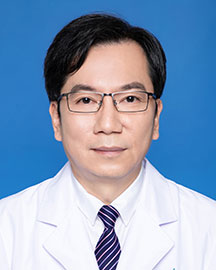

<!-- AUTO-GENERATED-BY: work/generate_obsidian_profiles.py -->

<!-- TEMPLATE: D:\workspace\信息收集整理\医生画像仓库\模板\医生画像模板.md -->

# 曾少颖

## 基础信息

| 字段 | 内容 |
|---|---|
| 姓名 | 曾少颖 |
| 医院 | 广东省人民医院 |
| 科室 | 心儿科 |
| 职称/身份 | 主任医师 |
| 来源链接 | [官网原文](https://www.gdghospital.org.cn/Expertlistt/info_itemid_24409_subjectid_81.html) |
| 采集日期 | 2026-08-14 |

## 简介/擅长

儿科和新生儿先天性心脏病、心肌病、心肌炎、心律失常和心源性猝死的病因诊断，尤其在儿科和新生儿重症心肌炎、心律失常、心源猝死的治疗有比较高的造诣

## 教育与进修经历

- 1991年毕业于暨南大学医学临床医学系，从事儿科心血管专业33年，擅长儿科和新生儿先天性心脏病、心肌病、心肌炎、心律失常和心源性猝死的病因诊断，尤其在儿科和新生儿重症心肌炎、心律失常、心源猝死的治疗有比较高的造诣；
- 国家卫计委首批心内科心内电生理+射频消融以及心脏器械植入诊疗培训基地导师和考官，中华医学会心电生理和起搏分会第六、七届小儿心律学学组副组长；

## 可包装亮点

- 国家卫计委首批心内科心内电生理+射频消融以及心脏器械植入诊疗培训基地导师和考官，中华医学会心电生理和起搏分会第六、七届小儿心律学学组副组长；
- 中国生物医学工程学会心律学分会第十届、十一届儿童心律学学组副组长，中华医学会儿科分会心血管学组儿童心律失常协助组副组长。

## 重点疾病/人群标签

- 慢性病：
- 肿瘤：
- 生殖疾病：
- 免疫/风湿：
- 术后恢复/康复：
- 疑难重症：重症

## 证据摘录

> 只摘录官网公开信息中的短句或关键字段，不复制大段原文。

- 官网身份字段：主任医师
- 官网简介/擅长：儿科和新生儿先天性心脏病、心肌病、心肌炎、心律失常和心源性猝死的病因诊断，尤其在儿科和新生儿重症心肌炎、心律失常、心源猝死的治疗有比较高的造诣
- 官网亮眼经历线索：国家卫计委首批心内科心内电生理+射频消融以及心脏器械植入诊疗培训基地导师和考官，中华医学会心电生理和起搏分会第六、七届小儿心律学学组副组长； 中国生物医学工程学会心律学分会第十届、十一届儿童心律学学组副组长，中华医学会儿科分会心血管学组儿童心律失常协助组副组长。
- 来源链接：https://www.gdghospital.org.cn/Expertlistt/info_itemid_24409_subjectid_81.html

## BD 画像摘要

曾少颖医生可作为疑难重症方向的基础画像候选。后续 BD 使用应继续以官网来源和人工复核为准，不添加疗效承诺或无来源包装。

## 合规边界

- 仅使用医院官网、官方公众号、官方小程序等公开渠道。
- 不采集私人电话、私人微信、家庭住址、患者隐私或非公开排班信息。
- 不写“保证治愈”“疗效第一”“包治疑难杂症”等无法由官网证明的表述。
