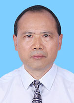

<!-- AUTO-GENERATED-BY: work/generate_obsidian_profiles.py -->

<!-- TEMPLATE: D:\workspace\信息收集整理\医生画像仓库\模板\医生画像模板.md -->

# 曾文新

## 基础信息

| 字段 | 内容 |
|---|---|
| 姓名 | 曾文新 |
| 医院 | 广东省人民医院 |
| 科室 | 重症医学科、急诊科 |
| 职称/身份 | 主任医师 |
| 来源链接 | [官网原文](https://www.gdghospital.org.cn/Expertlistt/info_itemid_25442_subjectid_100.html) |
| 采集日期 | 2026-08-14 |

## 简介/擅长

各种危重病的诊治和抢救，特别是对各种休克、多器官功能障碍综合征、心衰、重症哮喘、急性呼吸衰竭、重症急性胰腺炎、糖尿病酮症酸中毒、重症肺炎、多发性创伤、重型颅脑损伤及各种中毒等

## 科研项目与成果

- 在国内医学核心期刊发表学术论文二十余篇，参与广东省卫生厅、广东省科技厅等医学科研课题6项。

## 论文与学术产出

- 在国内医学核心期刊发表学术论文二十余篇，参与广东省卫生厅、广东省科技厅等医学科研课题6项。

## 可包装亮点

- 学会任职 ： 中华医学会急诊医学分会急性抗感染学组委员 中国医师协会急诊医师分会神经急诊专业委员会委员 广东省中西医结合学会高血压专业委员会委员 广东省中西医结合学会灾害医学专业委员会委员 中国研究型医院学会卫生应急学专业委员会委员 个人荣誉 ：2003年获得广州市抗击非典先进个人称号；
- 长期从事急危重症工作，对各种疑难危重病例救治具有丰富的临床经验。
- 擅长各种危重病的诊治和抢救，特别是对各种休克、多器官功能障碍综合征、心衰、重症哮喘、急性呼吸衰竭、重症急性胰腺炎、糖尿病酮症酸中毒、重症肺炎、多发性创伤、重型颅脑损伤及各种中毒等。
- 在国内医学核心期刊发表学术论文二十余篇，参与广东省卫生厅、广东省科技厅等医学科研课题6项。

## 重点疾病/人群标签

- 慢性病：高血压、糖尿病、心衰、感染、功能障碍、疑难、危重、重症、急危重
- 肿瘤：
- 生殖疾病：
- 免疫/风湿：高血压、糖尿病、心衰、感染、功能障碍、疑难、危重、重症、急危重
- 术后恢复/康复：高血压、糖尿病、心衰、感染、功能障碍、疑难、危重、重症、急危重
- 疑难重症：高血压、糖尿病、心衰、感染、功能障碍、疑难、危重、重症、急危重

## 证据摘录

> 只摘录官网公开信息中的短句或关键字段，不复制大段原文。

- 官网身份字段：主任医师
- 官网简介/擅长：各种危重病的诊治和抢救，特别是对各种休克、多器官功能障碍综合征、心衰、重症哮喘、急性呼吸衰竭、重症急性胰腺炎、糖尿病酮症酸中毒、重症肺炎、多发性创伤、重型颅脑损伤及各种中毒等
- 官网亮眼经历线索：学会任职 ： 中华医学会急诊医学分会急性抗感染学组委员 中国医师协会急诊医师分会神经急诊专业委员会委员 广东省中西医结合学会高血压专业委员会委员 广东省中西医结合学会灾害医学专业委员会委员 中国研究型医院学会卫生应急学专业委员会委员 个人荣誉 ：2003年获得广州市抗击非典先进个人称号； 长期从事急危重症工作，对各种疑难危重病例救治具有丰富的临床经验。 擅长各种危重病的诊治和抢救，特别是对各种休克、多器官功能障碍综合征、心衰、重症哮喘…
- 来源链接：https://www.gdghospital.org.cn/Expertlistt/info_itemid_25442_subjectid_100.html

## BD 画像摘要

曾文新医生可作为慢性病、免疫/风湿/感染、术后恢复/康复、疑难重症方向的基础画像候选。后续 BD 使用应继续以官网来源和人工复核为准，不添加疗效承诺或无来源包装。

## 合规边界

- 仅使用医院官网、官方公众号、官方小程序等公开渠道。
- 不采集私人电话、私人微信、家庭住址、患者隐私或非公开排班信息。
- 不写“保证治愈”“疗效第一”“包治疑难杂症”等无法由官网证明的表述。
