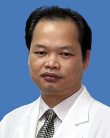

<!-- AUTO-GENERATED-BY: work/generate_obsidian_profiles.py -->

<!-- TEMPLATE: D:\workspace\信息收集整理\医生画像仓库\模板\医生画像模板.md -->

# 曾时兴

## 基础信息

| 字段 | 内容 |
|---|---|
| 姓名 | 曾时兴 |
| 医院 | 广东省人民医院 |
| 科室 | 脊柱外科 |
| 职称/身份 | 副主任医师 |
| 来源链接 | [官网原文](https://www.gdghospital.org.cn/Expertlistt/info_itemid_24307_subjectid_48.html) |
| 采集日期 | 2026-08-14 |

## 简介/擅长

如下疾病的诊断及治疗 1、颈椎病：首创直视探测法行下颈椎椎弓根螺丝钉内固定技术，该技术被喻为脊椎外科最高难度手术之一， 并取得了优良效果

## 教育与进修经历

- 1992年毕业后就职于广东省人民医院骨科，任住院医生，期间接受严格的外科特别是骨科专业的基本理论及基本技能培训；
- 1997年以广东省最优成绩获主治医生资格，此后每年主持完成骨科各类手术（大部分为颈椎、腰椎） 约300例，期间于中山医科大学从事脊柱外科显微解剖及手术安全性研究,，获脊柱外科硕士学位；
- 2003年10月在澳大利亚接受颈椎人工椎间盘置换技术培训；
- 2004年在法国接受脊椎侧弯矫形器械内固定技术培训；

## 可包装亮点

- 医学硕士 主要社会兼职 广东省骨科医师协会委员、广东省脊柱外科委员、广东省康复医学会脊柱脊髓分会脊柱脊髓肿瘤专业委员会第一届副主任委员、广东省医学会感染学组委员、颈椎病学组委员 教育经历和专业特长 1987年从广东茂名考入我国享有北协和南湘雅之称的湖南医科大学；
- 2002年获骨科副主任医师资格， 每年主持完成颈椎,腰椎高难度手术200多例；
- 2005年在美国芝加哥接受腰椎退行性变、严重脊椎畸形的外科手术技术培训。
- 国内核心期刊发表论文20余篇,如前纵韧带切除与否对颈椎病手术疗效的影响、下颈椎椎弓根螺丝钉内固定在颈椎后路融合术中的应用、前路脊柱肿瘤切除内固定治疗脊柱肿瘤、腰椎管狭窄手术疗效相关因素分析等。

## 重点疾病/人群标签

- 慢性病：
- 肿瘤：肿瘤、感染、术后、康复、恢复
- 生殖疾病：
- 免疫/风湿：肿瘤、感染、术后、康复、恢复
- 术后恢复/康复：肿瘤、感染、术后、康复、恢复
- 疑难重症：

## 证据摘录

> 只摘录官网公开信息中的短句或关键字段，不复制大段原文。

- 官网身份字段：副主任医师
- 官网简介/擅长：如下疾病的诊断及治疗 1、颈椎病：首创直视探测法行下颈椎椎弓根螺丝钉内固定技术，该技术被喻为脊椎外科最高难度手术之一， 并取得了优良效果
- 官网亮眼经历线索：医学硕士 主要社会兼职 广东省骨科医师协会委员、广东省脊柱外科委员、广东省康复医学会脊柱脊髓分会脊柱脊髓肿瘤专业委员会第一届副主任委员、广东省医学会感染学组委员、颈椎病学组委员 教育经历和专业特长 1987年从广东茂名考入我国享有北协和南湘雅之称的湖南医科大学； 2002年获骨科副主任医师资格， 每年主持完成颈椎,腰椎高难度手术200多例； 2005年在美国芝加哥接受腰椎退行性变、严重脊椎畸形的外科手术技术培训。 国内核心期刊发表论文…
- 来源链接：https://www.gdghospital.org.cn/Expertlistt/info_itemid_24307_subjectid_48.html

## BD 画像摘要

曾时兴医生可作为肿瘤、免疫/风湿/感染、术后恢复/康复方向的基础画像候选。后续 BD 使用应继续以官网来源和人工复核为准，不添加疗效承诺或无来源包装。

## 合规边界

- 仅使用医院官网、官方公众号、官方小程序等公开渠道。
- 不采集私人电话、私人微信、家庭住址、患者隐私或非公开排班信息。
- 不写“保证治愈”“疗效第一”“包治疑难杂症”等无法由官网证明的表述。
