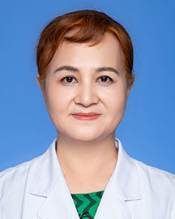

<!-- AUTO-GENERATED-BY: work/generate_obsidian_profiles.py -->

<!-- TEMPLATE: D:\workspace\信息收集整理\医生画像仓库\模板\医生画像模板.md -->

# 曾永红

## 基础信息

| 字段 | 内容 |
|---|---|
| 姓名 | 曾永红 |
| 医院 | 广东省人民医院 |
| 科室 | 康复医学科 |
| 职称/身份 | 主任医师 |
| 来源链接 | [官网原文](https://www.gdghospital.org.cn/Expertlistt/info_itemid_23069_subjectid_97.html) |
| 采集日期 | 2026-08-14 |

## 简介/擅长

用中西医结合方法和运动疗法治疗各种慢性疾病，对头痛、腰腿痛、颈椎病、肩周炎、骨质疏松症、偏瘫、小儿脑瘫、胃肠功能紊乱等针灸、康复诊治有丰富的经验

## 教育与进修经历

- 毕业于广州中医药大学和中山大学康复研究生课程班，从事针灸、康复理疗工作30多年，擅长用中西医结合方法和运动疗法治疗各种慢性疾病，对头痛、腰腿痛、颈椎病、肩周炎、骨质疏松症、偏瘫、小儿脑瘫、胃肠功能紊乱等针灸、康复诊治有丰富的经验。

## 可包装亮点

- 用中西医结合方法和运动疗法治疗各种慢性疾病，对头痛、腰腿痛、颈椎病、肩周炎、骨质疏松症、偏瘫、小儿脑瘫、胃肠功能紊乱等针灸、康复诊治有丰富的经验

## 重点疾病/人群标签

- 慢性病：慢性、康复、难治
- 肿瘤：
- 生殖疾病：
- 免疫/风湿：
- 术后恢复/康复：慢性、康复、难治
- 疑难重症：慢性、康复、难治

## 证据摘录

> 只摘录官网公开信息中的短句或关键字段，不复制大段原文。

- 官网身份字段：主任医师
- 官网简介/擅长：用中西医结合方法和运动疗法治疗各种慢性疾病，对头痛、腰腿痛、颈椎病、肩周炎、骨质疏松症、偏瘫、小儿脑瘫、胃肠功能紊乱等针灸、康复诊治有丰富的经验
- 来源链接：https://www.gdghospital.org.cn/Expertlistt/info_itemid_23069_subjectid_97.html

## BD 画像摘要

曾永红医生可作为慢性病、术后恢复/康复、疑难重症方向的基础画像候选。后续 BD 使用应继续以官网来源和人工复核为准，不添加疗效承诺或无来源包装。

## 合规边界

- 仅使用医院官网、官方公众号、官方小程序等公开渠道。
- 不采集私人电话、私人微信、家庭住址、患者隐私或非公开排班信息。
- 不写“保证治愈”“疗效第一”“包治疑难杂症”等无法由官网证明的表述。
