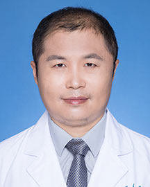

<!-- AUTO-GENERATED-BY: work/generate_obsidian_profiles.py -->

<!-- TEMPLATE: D:\workspace\信息收集整理\医生画像仓库\模板\医生画像模板.md -->

# 李伟峰

## 基础信息

| 字段 | 内容 |
|---|---|
| 姓名 | 李伟峰 |
| 医院 | 广东省人民医院 |
| 科室 | 急诊科 |
| 职称/身份 | 副主任医师 |
| 来源链接 | [官网原文](https://www.gdghospital.org.cn/Expertlistt/info_itemid_33771_subjectid_112.html) |
| 采集日期 | 2026-08-14 |

## 简介/擅长

## 科研项目与成果

- 研究方向 ： 长期从事急危重症相关领域的临床和科研工作，主要研究方向包括急性脑损伤后的发生和康复机制、人工智能辅助急危重症诊疗的应用研究。
- 主持和参与国自然科研基金、广东省医学科研基金、广州市科技项目等课题多项，在NeuroImage、Journal of Neuroscience、Human. Brain Mapping. Frontiers in Cellular Neuroscience等期刊上发表SCI论文15篇 。

## 论文与学术产出

- 主持和参与国自然科研基金、广东省医学科研基金、广州市科技项目等课题多项，在NeuroImage、Journal of Neuroscience、Human. Brain Mapping. Frontiers in Cellular Neuroscience等期刊上发表SCI论文15篇 。

## 可包装亮点

- 医学博士，广东省人民医院急诊抢救室副主任 美国院前创伤生命救援（PHTLS）资质，欧洲复苏委员会ILS资质，BLS导师。
- 中华急诊医学教育学院广东省分院秘书，中华医学会急诊医学分会信息化建设学组委员。
- 广东省基层医药学会急诊医学专委会秘书长，广东省中医药学会热病专业委员会委员、广东省医师协会急诊医师分会社会救助专业组委员，广东省急症预防与救治专业委员会委员。
- 研究方向 ： 长期从事急危重症相关领域的临床和科研工作，主要研究方向包括急性脑损伤后的发生和康复机制、人工智能辅助急危重症诊疗的应用研究。

## 重点疾病/人群标签

- 慢性病：
- 肿瘤：
- 生殖疾病：
- 免疫/风湿：
- 术后恢复/康复：康复、急危重
- 疑难重症：康复、急危重

## 证据摘录

> 只摘录官网公开信息中的短句或关键字段，不复制大段原文。

- 官网身份字段：副主任医师
- 官网亮眼经历线索：医学博士，广东省人民医院急诊抢救室副主任 美国院前创伤生命救援（PHTLS）资质，欧洲复苏委员会ILS资质，BLS导师。 中华急诊医学教育学院广东省分院秘书，中华医学会急诊医学分会信息化建设学组委员。 广东省基层医药学会急诊医学专委会秘书长，广东省中医药学会热病专业委员会委员、广东省医师协会急诊医师分会社会救助专业组委员，广东省急症预防与救治专业委员会委员。 研究方向 ： 长期从事急危重症相关领域的临床和科研工作，主要研究方向包括急性…
- 来源链接：https://www.gdghospital.org.cn/Expertlistt/info_itemid_33771_subjectid_112.html

## BD 画像摘要

李伟峰医生可作为术后恢复/康复、疑难重症方向的基础画像候选。后续 BD 使用应继续以官网来源和人工复核为准，不添加疗效承诺或无来源包装。

## 合规边界

- 仅使用医院官网、官方公众号、官方小程序等公开渠道。
- 不采集私人电话、私人微信、家庭住址、患者隐私或非公开排班信息。
- 不写“保证治愈”“疗效第一”“包治疑难杂症”等无法由官网证明的表述。
