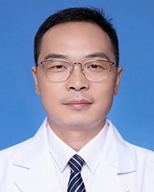

<!-- AUTO-GENERATED-BY: work/generate_obsidian_profiles.py -->

<!-- TEMPLATE: D:\workspace\信息收集整理\医生画像仓库\模板\医生画像模板.md -->

# 李俊

## 基础信息

| 字段 | 内容 |
|---|---|
| 姓名 | 李俊 |
| 医院 | 广东省人民医院 |
| 科室 | 口腔颌面外科 |
| 职称/身份 | 主治医师 |
| 来源链接 | [官网原文](https://www.gdghospital.org.cn/Expertlistt/info_itemid_34555_subjectid_86.html) |
| 采集日期 | 2026-08-14 |

## 简介/擅长

肿瘤外科切除及同期带蒂皮瓣或游离血管化皮瓣的重建修复术（包括常见的胸大肌皮瓣、前臂皮瓣、股前外侧肌皮瓣、游离腓骨肌皮瓣等的制备、显微吻合及数字化精准重建技术）

## 科研项目与成果

- 主持1项广东省医学科学技术研究基金项目以及参与多项省市级科研项目，在国内外期刊发表多篇学术论文。

## 论文与学术产出

- 主持1项广东省医学科学技术研究基金项目以及参与多项省市级科研项目，在国内外期刊发表多篇学术论文。

## 可包装亮点

- 教育履历： 广州医科大学 口腔医学 硕士 专业特长： 主要临床主要工作为口颌面部肿瘤、颌面畸形、外伤、骨髓炎等诊治，尤其擅长肿瘤外科切除及同期带蒂皮瓣或游离血管化皮瓣的重建修复术（包括常见的胸大肌皮瓣、前臂皮瓣、股前外侧肌皮瓣、游离腓骨肌皮瓣等的制备、显微吻合及数字化精准重建技术）；
- 主持1项广东省医学科学技术研究基金项目以及参与多项省市级科研项目，在国内外期刊发表多篇学术论文。
- 学术任职： 广东省医学会颌面头颈外科专业委员会 委员 广东省口腔医学会口腔颌面外科专委会 青年委员

## 重点疾病/人群标签

- 慢性病：
- 肿瘤：肿瘤、复杂
- 生殖疾病：
- 免疫/风湿：
- 术后恢复/康复：
- 疑难重症：肿瘤、复杂

## 证据摘录

> 只摘录官网公开信息中的短句或关键字段，不复制大段原文。

- 官网身份字段：主治医师
- 官网简介/擅长：肿瘤外科切除及同期带蒂皮瓣或游离血管化皮瓣的重建修复术（包括常见的胸大肌皮瓣、前臂皮瓣、股前外侧肌皮瓣、游离腓骨肌皮瓣等的制备、显微吻合及数字化精准重建技术）
- 官网亮眼经历线索：教育履历： 广州医科大学 口腔医学 硕士 专业特长： 主要临床主要工作为口颌面部肿瘤、颌面畸形、外伤、骨髓炎等诊治，尤其擅长肿瘤外科切除及同期带蒂皮瓣或游离血管化皮瓣的重建修复术（包括常见的胸大肌皮瓣、前臂皮瓣、股前外侧肌皮瓣、游离腓骨肌皮瓣等的制备、显微吻合及数字化精准重建技术）； 主持1项广东省医学科学技术研究基金项目以及参与多项省市级科研项目，在国内外期刊发表多篇学术论文。 学术任职： 广东省医学会颌面头颈外科专业委员会 委员…
- 来源链接：https://www.gdghospital.org.cn/Expertlistt/info_itemid_34555_subjectid_86.html

## BD 画像摘要

李俊医生可作为肿瘤、疑难重症方向的基础画像候选。后续 BD 使用应继续以官网来源和人工复核为准，不添加疗效承诺或无来源包装。

## 合规边界

- 仅使用医院官网、官方公众号、官方小程序等公开渠道。
- 不采集私人电话、私人微信、家庭住址、患者隐私或非公开排班信息。
- 不写“保证治愈”“疗效第一”“包治疑难杂症”等无法由官网证明的表述。
