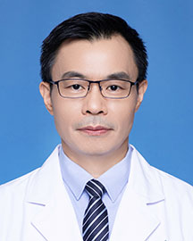

<!-- AUTO-GENERATED-BY: work/generate_obsidian_profiles.py -->

<!-- TEMPLATE: D:\workspace\信息收集整理\医生画像仓库\模板\医生画像模板.md -->

# 李俊杰

## 基础信息

| 字段 | 内容 |
|---|---|
| 姓名 | 李俊杰 |
| 医院 | 广东省人民医院 |
| 科室 | 心儿科 |
| 职称/身份 | 副主任医师 |
| 来源链接 | [官网原文](https://www.gdghospital.org.cn/Expertlistt/info_itemid_24418_subjectid_81.html) |
| 采集日期 | 2026-08-14 |

## 简介/擅长

动脉导管未闭、肺动脉狭窄、房间隔缺损、室间隔缺损等疾病的介入治疗，在国内率先开展新生儿及婴幼儿危重症先心如肺动脉瓣闭锁、极重度肺动脉瓣狭窄、动脉导管未闭及主动脉瓣狭窄的介入治疗

## 教育与进修经历

- 医学硕士，心儿科副主任医师 1993年毕业于河南医科大学儿科医学系，2000年于广东省心血管病研究所获医学硕士。

## 科研项目与成果

- 主持及主要参与国家“十五”攻关、国家“十一五”支撑计划、广东省科技攻关及广东省医学研究等多项科研项目，其中国家“十五”科技攻关项目“先天性心脏病介入治疗器械的研制”获得了广东省科技奖励一等奖及第六届宋庆龄儿科医学奖。

## 论文与学术产出

- 以第一作者及通讯作者在国内外核心学术刊物上发表论著三十余篇，参加编写学术著作3本。

## 可包装亮点

- 医学硕士，心儿科副主任医师 1993年毕业于河南医科大学儿科医学系，2000年于广东省心血管病研究所获医学硕士。
- 从事小儿心血管专业近30年，在先天性心脏病的诊断和治疗方面有较深的造诣和精湛的技术，尤其擅长动脉导管未闭、肺动脉狭窄、房间隔缺损、室间隔缺损等疾病的介入治疗，在国内率先开展新生儿及婴幼儿危重症先心如肺动脉瓣闭锁、极重度肺动脉瓣狭窄、动脉导管未闭及主动脉瓣狭窄的介入治疗。
- 兼任中国研究型医院学会结构性心脏病专业委员会常委，广东省中医药学会心脏血脉专委会副主任委员，广东省医学会介入心脏病分会结构性心脏病学组常委等职。
- 主持及主要参与国家“十五”攻关、国家“十一五”支撑计划、广东省科技攻关及广东省医学研究等多项科研项目，其中国家“十五”科技攻关项目“先天性心脏病介入治疗器械的研制”获得了广东省科技奖励一等奖及第六届宋庆龄儿科医学奖。

## 重点疾病/人群标签

- 慢性病：
- 肿瘤：
- 生殖疾病：
- 免疫/风湿：
- 术后恢复/康复：
- 疑难重症：危重

## 证据摘录

> 只摘录官网公开信息中的短句或关键字段，不复制大段原文。

- 官网身份字段：副主任医师
- 官网简介/擅长：动脉导管未闭、肺动脉狭窄、房间隔缺损、室间隔缺损等疾病的介入治疗，在国内率先开展新生儿及婴幼儿危重症先心如肺动脉瓣闭锁、极重度肺动脉瓣狭窄、动脉导管未闭及主动脉瓣狭窄的介入治疗
- 官网亮眼经历线索：医学硕士，心儿科副主任医师 1993年毕业于河南医科大学儿科医学系，2000年于广东省心血管病研究所获医学硕士。 从事小儿心血管专业近30年，在先天性心脏病的诊断和治疗方面有较深的造诣和精湛的技术，尤其擅长动脉导管未闭、肺动脉狭窄、房间隔缺损、室间隔缺损等疾病的介入治疗，在国内率先开展新生儿及婴幼儿危重症先心如肺动脉瓣闭锁、极重度肺动脉瓣狭窄、动脉导管未闭及主动脉瓣狭窄的介入治疗。 兼任中国研究型医院学会结构性心脏病专业委员会常委，广…
- 来源链接：https://www.gdghospital.org.cn/Expertlistt/info_itemid_24418_subjectid_81.html

## BD 画像摘要

李俊杰医生可作为疑难重症方向的基础画像候选。后续 BD 使用应继续以官网来源和人工复核为准，不添加疗效承诺或无来源包装。

## 合规边界

- 仅使用医院官网、官方公众号、官方小程序等公开渠道。
- 不采集私人电话、私人微信、家庭住址、患者隐私或非公开排班信息。
- 不写“保证治愈”“疗效第一”“包治疑难杂症”等无法由官网证明的表述。
